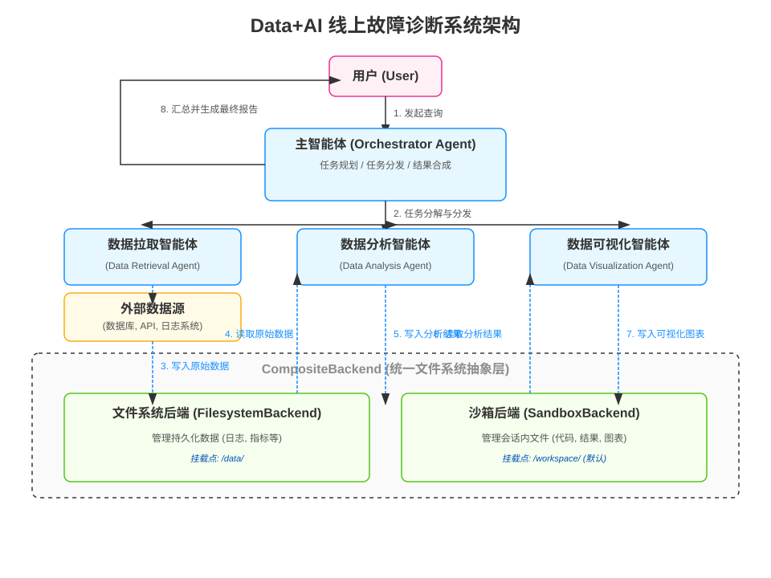

# Data+AI 线上故障诊断系统设计方案

本文档详细阐述了一个基于 `deepagents` 框架的 Data+AI 线上故障诊断系统的完整设计方案。该方案旨在通过多智能体协作的方式，自动化地完成数据拉取、数据分析和结果可视化，从而高效地定位线上问题。

## 1. 核心组件: `CompositeBackend` 详解

`CompositeBackend` 是整个系统能够高效处理代码与数据的关键。它作为一个智能的“路由器”，允许我们将不同的文件系统路径映射到不同的存储后端，完美地契合了“代码在沙箱，数据在本地”的设计思想。

### 1.1. 工作原理

`CompositeBackend` 的核心是**基于前缀的路由**机制：

1.  **初始化**: 在创建 `CompositeBackend` 时，需要提供一个 `default` 默认后端和一份 `routes` 路由表。路由表是一个字典，定义了路径前缀与特定后端的映射关系（例如 `{"/data/": filesystem_backend}`）。
2.  **路径匹配**: 当 Agent 尝试访问一个文件路径时，`CompositeBackend` 会在路由表中查找与该路径匹配的最长前缀。
3.  **操作分发**:
    *   如果找到匹配的路由，`CompositeBackend` 会剥离路径前缀，并将文件操作（读、写等）分发给对应的后端处理。
    *   如果未找到匹配项，则操作将由 `default` 后端处理。

### 1.2. 配置示例

在我们的系统中，我们将 `SandboxBackend` 作为默认后端来管理隔离的工作区文件，同时将 `FilesystemBackend` 挂载到 `/data` 目录来处理持久化的大型数据文件。

```python
from deepagents.backends.composite import CompositeBackend
from deepagents.backends.filesystem import FilesystemBackend
from deepagents.backends.sandbox import SandboxBackend

# 1. 初始化 SandboxBackend 作为默认后端，用于管理 /workspace 等路径
sandbox_backend = SandboxBackend()

# 2. 初始化 FilesystemBackend，将本地的 `./data` 目录映射到 Agent 的 `/data` 路径
filesystem_backend = FilesystemBackend(base_dir="./data")

# 3. 初始化 CompositeBackend 并配置路由
# - default: 所有未匹配的请求都将由 sandbox_backend 处理。
# - routes: 所有以 `/data/` 开头的路径都将被路由到 filesystem_backend。
composite_backend = CompositeBackend(
    default=sandbox_backend,
    routes={
        "/data/": filesystem_backend,
    }
)
```

---

## 2. 系统架构设计

我们采用“**Orchestrator + Sub-agents**”（编排者 + 子智能体）的多智能体架构模式。该模式将复杂的诊断任务分解给多个领域专家子智能体，由一个中心编排者负责协调，最终合成一份统一的报告。

### 2.1. 架构图



### 2.2. 智能体角色

*   **Orchestrator Agent (主智能体/编排者)**
    *   **职责**: 系统的总指挥。负责理解用户意图、制定详细的诊断计划、将任务分发给合适的子智能体、跟踪进度，并最终将所有结果整合成一份易于理解的报告。

*   **Sub-agents (子智能体/领域专家)**
    *   **`Data Retrieval Agent` (数据拉取智能体)**: 负责从数据库、API、日志平台等外部数据源获取原始数据。
    *   **`Data Analysis Agent` (数据分析智能体)**: 负责对原始数据进行深度分析，找出异常模式和因果关系。
    *   **`Data Visualization Agent` (数据可视化智能体)**: 负责将复杂的分析结果转化为直观的图表。

### 2.3. 典型工作流程

1.  **用户查询**: 用户发起查询，例如“分析今天下午3点登录失败激增的原因”。
2.  **任务规划**: `Orchestrator Agent` 将任务分解为：拉取数据、分析数据、可视化结果。
3.  **数据拉取**: `Orchestrator` 指派 `Data Retrieval Agent` 从日志系统拉取数据，并保存至 `/data/login_errors.log`。`CompositeBackend` 将此操作路由到 `FilesystemBackend`，数据被持久化到本地。
4.  **数据分析**: `Data Analysis Agent` 被调用，它从 `/data/` 读取日志，执行分析脚本，并将分析摘要（如 `summary.md`）写入 `/workspace/results/`。`CompositeBackend` 将此操作路由到 `SandboxBackend`。
5.  **数据可视化**: `Data Visualization Agent` 读取分析结果，生成图表（如 `error_rate.svg`），并保存到 `/workspace/visualizations/`。此操作同样由 `SandboxBackend` 处理。
6.  **报告合成**: `Orchestrator Agent` 收集所有产出，整合成一份包含文字摘要和图表的完整报告，最终呈现给用户。

---

## 3. 子智能体与技能详细设计

为了最大化灵活性和可扩展性，我们为每个子智能体设计了一个核心的、通用的技能：**执行动态生成的 Python 脚本**。这使得智能体可以根据具体任务上下文，即时编写代码来解决问题。

### 3.1. Data Retrieval Agent (数据拉取智能体)

*   **职责**: 连接外部数据源，执行查询，并将结果可靠地存储到 `/data/` 目录。
*   **技能定义 (`data_retrieval/SKILL.md`)**:
    ```yaml
    # ---
    # name: data_retrieval_skill
    # description: 用于从各种数据源获取数据并将其存储在 /data 目录中的技能。
    # tools:
    #   - retrieval_tools.run_python_script_to_fetch_data
    # ---
    ```
*   **工具定义 (`retrieval_tools.py`)**:
    ```python
    def run_python_script_to_fetch_data(script: str) -> str:
        """
        执行一段 Python 脚本来获取数据。
        脚本必须将最终获取的数据写入到 `/data/` 目录下。
        成功后，应返回一个描述操作结果和输出文件路径的字符串。
        """
        # 后端安全地执行该脚本
        pass
    ```

### 3.2. Data Analysis Agent (数据分析智能体)

*   **职责**: 对 `/data/` 目录下的原始数据进行深度分析，并将结论存储在 `/workspace/results/` 目录。
*   **技能定义 (`data_analysis/SKILL.md`)**:
    ```yaml
    # ---
    # name: data_analysis_skill
    # description: 用于对 /data 中的数据执行分析的技能。
    # tools:
    #   - analysis_tools.run_python_analysis_script
    # ---
    ```
*   **工具定义 (`analysis_tools.py`)**:
    ```python
    def run_python_analysis_script(script: str) -> str:
        """
        执行一段 Python 脚本来进行数据分析。
        脚本应从 `/data/` 读取数据，并将结果写入到 `/workspace/results/` 目录。
        成功后，应返回一个对分析结果的简要总结。
        """
        # 后端安全地执行该脚本
        pass
    ```

### 3.3. Data Visualization Agent (数据可视化智能体)

*   **职责**: 将数据或分析结果转化为直观的图表，并保存在 `/workspace/visualizations/` 目录。
*   **技能定义 (`data_visualization/SKILL.md`)**:
    ```yaml
    # ---
    # name: data_visualization_skill
    # description: 用于将数据转化为可视化图表的技能。
    # tools:
    #   - visualization_tools.run_python_visualization_script
    # ---
    ```
*   **工具定义 (`visualization_tools.py`)**:
    ```python
    def run_python_visualization_script(script: str) -> str:
        """
        执行一段 Python 脚本来生成数据可视化图表。
        脚本应将生成的图表文件保存到 `/workspace/visualizations/` 目录。
        成功后，应返回一个描述生成了哪些图表的字符串。
        """
        # 后端安全地执行该脚本
        pass
    ```
