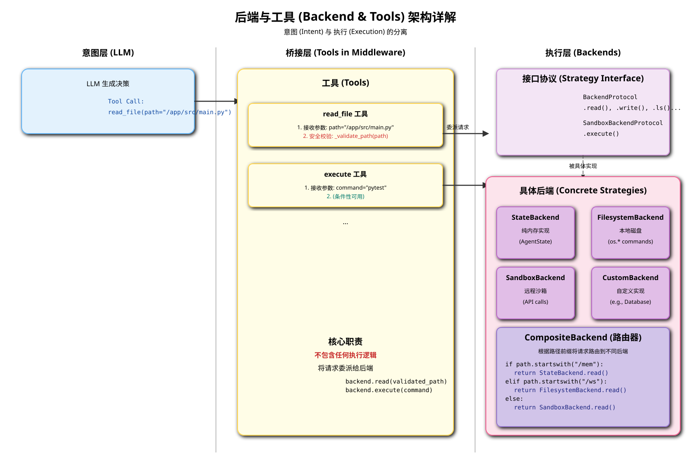

# 核心架构解析: 后端与工具 (Backend & Tools)

在 `deepagents` 框架中，“后端与工具”是智能体（Agent）与外部世界进行交互的**核心执行层**。这两者紧密协作，共同构成了一个功能强大、高度可扩展的操作平台。本文档将深入解析该模块的架构设计、工作原理以及两者之间的关系。

## 1. 核心理念：意图与执行的分离

该模块设计的核心理念是**将智能体的“意图”（Intent）与“执行”（Execution）彻底分离**。

-   **意图 (Intent)**: LLM 产生的决策，表现为对某个工具的调用（Tool Call），例如 `read_file(path="/app/main.py")`。这仅仅是一个请求，一个“我想做什么”的声明。
-   **执行 (Execution)**: 真正地去完成这个请求。是实际地从磁盘读取文件，还是向远程沙箱发送一个 API 请求？是在内存中创建一个虚拟文件，还是将数据存入数据库？这些都是“如何做”的具体实现。

**后端（Backend）就是“执行”的具体承担者，而工具（Tools）则是连接“意图”和“执行”的桥梁。**

## 2. 后端架构 (`Backend`)

后端架构是实现可扩展性的关键。它基于一个统一的接口约定，允许开发者轻松替换或组合不同的“执行环境”。

*(上图的 SVG 文件将一并提供)*

### 2.1. 接口协议 (`protocol.py`)

`BackendProtocol` 和 `SandboxBackendProtocol` 定义了所有后端实现都必须遵守的“契约”。

-   **`BackendProtocol`**: 定义了所有与**文件系统**相关的基础操作接口，例如：
    -   `read(path)` / `aread(path)`
    -   `write(path, content)` / `awrite(path, content)`
    -   `ls(path)` / `als(path)`
    -   `glob(pattern)` / `aglob(pattern)`
    -   `grep(pattern)` / `agrep(pattern)`
    -   `edit(...)` / `aedit(...)`

    任何实现了这个接口的类，都可以被视为一个功能完备的“虚拟文件系统”。

-   **`SandboxBackendProtocol`**: 继承自 `BackendProtocol`，并额外增加了一个核心方法：
    -   `execute(command)` / `aexecute(command)`

    这个接口标识了一个后端不仅具备文件操作能力，还拥有在一个**隔离的、安全的环境中执行任意 Shell 命令**的能力。

### 2.2. 后端实现 (Implementations)

`deepagents` 提供了多种开箱即用的后端实现：

-   **`StateBackend`**: 一个纯内存的后端。所有的“文件”都直接存储在智能体的 `AgentState` 中。这对于需要临时文件、无需持久化的任务非常有用，速度快且无副作用。
-   **`StoreBackend` / `FilesystemBackend`**: 直接与**本地物理文件系统**交互。智能体的操作会真实地反映在运行机器的磁盘上。
-   **`SandboxBackend`**: 实现了 `SandboxBackendProtocol`，通常它会与一个外部的、隔离的执行环境（如 Docker 容器、远程虚拟机）通过 API 进行通信，将文件操作和命令执行请求转发到该环境中。这是执行不可信代码或进行有风险操作时的**最佳安全实践**。
-   **`CompositeBackend` (复合后端)**: 这是一个强大的“路由器”或“代理”后端。它允许你将不同的路径前缀路由到不同的后端实现。
    -   **示例**: 你可以配置 `CompositeBackend`，将所有对 `/workspace/` 目录的请求路由到 `FilesystemBackend`（本地文件），将 `/tmp/` 目录的请求路由到 `StateBackend`（内存），并将所有其他请求默认路由到 `SandboxBackend`（沙箱）。
    -   **价值**: 这提供了极高的灵活性，允许根据需求为不同的操作提供最优的存储和执行策略。

## 3. 工具 (`Tools`)

工具是暴露给 LLM 的可调用函数，它们是 `FilesystemMiddleware` 的核心产物。

### 3.1. 工具的职责

-   **定义接口**: 每个工具（如 `read_file`, `execute`）都定义了清晰的函数签名（参数、类型、描述），供 LLM 理解和调用。这些描述是**至关重要的 Prompt 的一部分**。
-   **接收意图**: 当 LLM 决定调用一个工具时，工具函数被触发，接收来自 LLM 的参数（如 `file_path`, `command`）。
-   **安全校验**: 在将请求传递给后端之前，工具会执行关键的预处理和安全检查。最重要的例子就是 `_validate_path`，它在所有文件操作工具中被调用，以防止路径遍历等攻击。
-   **委派执行**: 工具自身**不包含任何执行逻辑**。它的核心职责是将经过校验和处理的请求，**委派（Delegate）**给当前配置的后端（Backend）来实际执行。例如，`read_file` 工具会调用 `backend.read()` 方法。

### 3.2. 工具与后端的动态关系

工具和后端是**解耦**的。工具在被创建时（通过工具生成器），会接收一个 `backend` 实例的引用。当工具被调用时，它只是简单地调用该 `backend` 实例上的相应方法。

这种设计意味着：

-   **工具代码是通用的**: `read_file` 工具的代码只有一套。
-   **行为是动态的**:
    -   当 `read_file` 与 `StateBackend` 结合时，它读取的是内存中的数据。
    -   当它与 `FilesystemBackend` 结合时，它读取的是本地磁盘。
    -   当它与 `SandboxBackend` 结合时，它读取的是远程沙箱中的文件。

特别是 `execute` 工具，它的可用性完全由后端决定。`FilesystemMiddleware` 会在运行时检查其 `backend` 是否为 `SandboxBackendProtocol` 的实例。如果是，`execute` 工具才会被创建并暴露给 LLM；否则，它将保持隐藏。

## 4. 总结

“后端与工具”模块是一个典型的**策略模式（Strategy Pattern）**应用：

-   **上下文 (Context)**: `FilesystemMiddleware` 和其中的工具。
-   **策略接口 (Strategy Interface)**: `BackendProtocol`。
-   **具体策略 (Concrete Strategies)**: `StateBackend`, `FilesystemBackend`, `SandboxBackend` 等。

通过这种设计，`deepagents` 实现了一个灵活、安全、可扩展的执行层。智能体可以根据任务需求，被配置在不同的“操作模式”（内存、本地、沙箱）下运行，而无需改变其核心的推理和决策逻辑。
