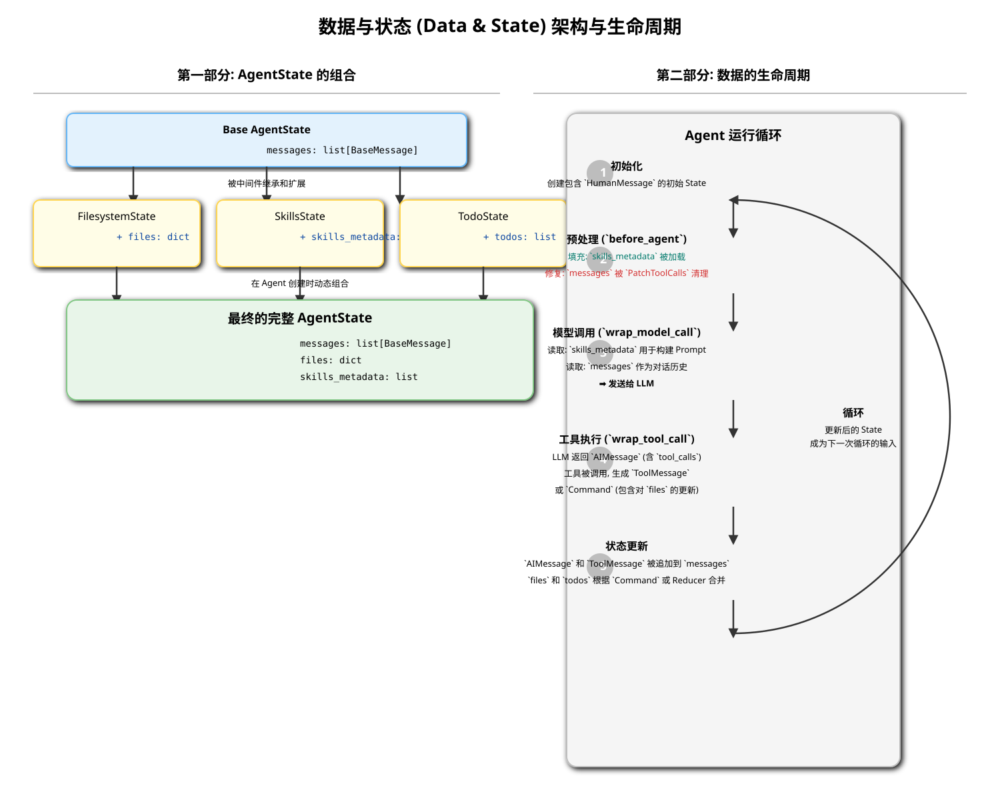

# 核心架构解析: 数据与状态 (Data & State)

在 `deepagents` 框架（基于 LangGraph）中，“数据与状态”（Data & State）是驱动整个智能体（Agent）运行的**核心载体**。它就像是智能体的“记忆”和“工作台”，记录了交互的完整历史，并承载了所有中间步骤产生的数据。理解状态管理机制，是理解智能体如何思考和工作的关键。

## 1. 核心数据结构: `AgentState`

`AgentState` 是一个 `TypedDict`，可以理解为一个**结构化的数据容器**。它被设计成一个可扩展的字典，作为整个 LangGraph 执行图（Execution Graph）中所有节点共享的上下文。

*(上图的 SVG 文件将一并提供)*

### 1.1. 基础结构

所有特定状态的基础都源于一个最小的 `AgentState` 定义，它通常只包含一个核心字段：

-   **`messages`: `list[BaseMessage]`**: 这是智能体状态的**基石**。它是一个消息列表，按照时间顺序记录了用户、AI 和工具之间的所有交互。
    -   `HumanMessage`: 用户的输入。
    -   `AIMessage`: LLM 的回复，可能包含文本内容和/或工具调用（`tool_calls`）。
    -   `ToolMessage`: 工具执行后返回的结果。

    这个 `messages` 列表不仅是对话历史的记录，更是 LLM 在下一次进行推理决策时**最重要的上下文来源**。

### 1.2. 状态的扩展与组合

`deepagents` 的中间件（Middleware）架构巧妙地利用了 `AgentState` 的可扩展性。每个需要管理自己特定状态的中间件，都会定义一个继承自 `AgentState` 的、属于自己的 `TypedDict`。

-   **`FilesystemState(AgentState)`**:
    -   **添加字段**: `files: Annotated[dict, _file_data_reducer]`
    -   **作用**: `FilesystemMiddleware` 在这里存储一个虚拟文件系统的状态。字典的键是文件路径，值是文件的内容和元数据。`Annotated` 和 `_file_data_reducer` 是一种高级用法，它定义了当多个节点都尝试更新 `files` 状态时，应该如何合并这些更新（例如，支持文件删除）。

-   **`SkillsState(AgentState)`**:
    -   **添加字段**: `skills_metadata: list[SkillMetadata]`
    -   **作用**: `SkillsMiddleware` 在 `before_agent` 阶段从文件系统加载所有可用技能的元数据（名称、描述、路径），并将其存储在这里。后续的 `wrap_model_call` 阶段会读取这个状态，将其格式化后注入到系统提示中。

-   **`TodoState(AgentState)`**: (将在后续分析中添加)
    -   **添加字段**: `todos: list[str]`
    -   **作用**: `TodoMiddleware` 在这里存储一个待办事项列表。

最终，当一个包含多个中间件的智能体被创建时，所有这些独立的 `State` 类型会被动态地组合成一个**最终的、完整的 `AgentState`**。这个最终的状态包含了所有中间件所需的数据字段，形成一个统一的数据视图。

## 2. 数据的生命周期与流动

数据在 `AgentState` 中的流动遵循 LangGraph 的执行模型。

1.  **初始化 (Initialization)**:
    -   当一个新会话开始时，`AgentState` 被创建，通常只包含一个初始的 `HumanMessage`。

2.  **中间件预处理 (`before_agent`)**:
    -   在智能体主逻辑运行前，`before_agent` 钩子被触发。
    -   像 `SkillsMiddleware` 这样的中间件会在此阶段**填充**状态。例如，它会读取技能文件，然后用技能元数据更新 `state['skills_metadata']`。
    -   像 `PatchToolCallsMiddleware` 这样的中间件会在此阶段**读取并修复**状态。它会检查 `state['messages']` 中是否有逻辑不一致的地方，并返回一个修复后的版本。

3.  **模型调用 (`wrap_model_call`)**:
    -   这是状态**最重要**的“被读取”的阶段。
    -   `wrap_model_call` 钩子被触发，中间件从 `state` 中读取所需信息（如 `skills_metadata`）来动态构建最终的系统提示。
    -   完整的 `state['messages']` 列表作为对话历史，与系统提示一起被发送给 LLM。

4.  **工具执行 (`wrap_tool_call`)**:
    -   当 LLM 返回一个工具调用时，`wrap_tool_call` 钩子被触发。
    -   工具执行的结果（`ToolMessage`）会被生成。
    -   一些特殊的工具（例如 `write_file` 或 `edit_file`）可能会直接返回一个 `Command`，该命令不仅包含 `ToolMessage`，还包含对 `state` 中其他部分的直接更新（如 `files` 字段）。

5.  **状态更新 (State Update)**:
    -   LangGraph 运行时（Runtime）收集所有新生成的消息和命令，并将它们合并回 `AgentState` 中。
    -   新消息被**追加**到 `state['messages']` 列表的末尾。
    -   其他状态字段（如 `files`, `todos`）根据返回的 `Command` 或指定的合并规则（Reducer）进行更新。

6.  **循环 (Loop)**:
    -   更新后的 `AgentState` 将作为输入，进入下一个运行循环，从步骤 2 重新开始。

## 3. 总结

`AgentState` 不仅仅是一个简单的数据字典，它是 `deepagents` 框架实现模块化和可扩展性的**核心枢纽**。

-   **统一的数据总线**: 它为所有独立的中间件提供了一个共享的、统一的数据访问点。
-   **模块化状态管理**: 每个中间件只负责定义、读取和更新与自己功能相关的状态片（Slice），实现了高度的内聚和低耦合。
-   **驱动执行流程**: `AgentState` 的内容（特别是 `messages` 列表）直接决定了 LLM 的下一步决策，从而驱动了整个智能体的行为。
-   **可追溯性与调试**: 由于 `AgentState` 记录了每一步的完整快照，它为调试和理解智能体的“思考过程”提供了极大的便利。
