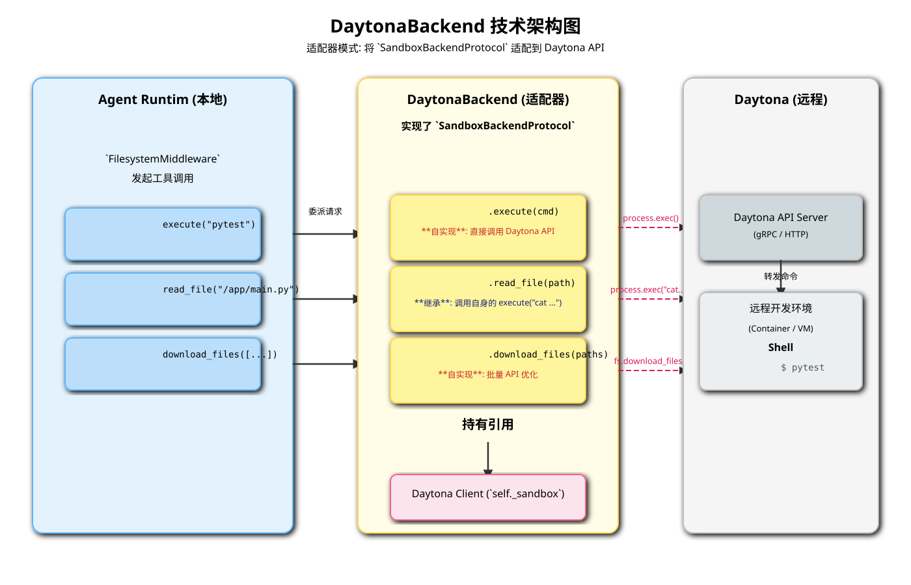

# DaytonaBackend 深度解析

`DaytonaBackend` 是 `BaseSandbox` 的一个具体实现，它充当了 `deepagents` 框架与 [Daytona](https://daytona.io/) 开发环境管理平台之间的**桥梁**。它的核心职责是将智能体的文件系统操作和命令执行请求，转化为对 Daytona Sandbox API 的调用，从而在一个远程的、由 Daytona 管理的标准化开发环境中执行这些操作。

## 1. 核心定位与优势

-   **标准化开发环境**: Daytona 擅长于根据代码库快速启动一个标准化的、可复现的远程开发环境。使用 `DaytonaBackend`，意味着 Agent 可以在一个与人类开发者完全一致的环境中工作，这对于代码理解、构建、测试等任务至关重要。
-   **远程执行**: 将计算密集型或有环境依赖的任务（如编译、运行测试）从运行 Agent 的本地机器上卸载到远程的 Daytona 环境中。
-   **API 驱动**: 所有的交互都是通过结构化的 Daytona API 完成的，这比直接通过 SSH 操作更稳定、更安全。
-   **性能优化**: `DaytonaBackend` 针对文件传输进行了特别优化，利用 Daytona 的原生批量 API 来实现高效的批量文件上传和下载。

## 2. 技术架构

`DaytonaBackend` 的架构是一个典型的**适配器模式（Adapter Pattern）**。它将 `deepagents` 的 `SandboxBackendProtocol` 接口“适配”到 Daytona 客户端库的特定接口上。

*(上图的 SVG 文件将一并提供)*

其关键组件包括：

1.  **Agent Core**: 智能体核心，通过 `FilesystemMiddleware` 发出工具调用请求（如 `execute`）。
2.  **`DaytonaBackend` 实例**:
    -   它持有一个 `daytona.Sandbox` 客户端实例的引用 (`self._sandbox`)，这个实例在 `DaytonaBackend` 被创建时注入。
    -   它实现了 `SandboxBackendProtocol` 接口。
3.  **`daytona.Sandbox` (Daytona 客户端)**:
    -   这是与 Daytona API 交互的底层客户端库。
    -   它暴露了多个子系统，如 `process`（用于命令执行）和 `fs`（用于文件系统操作）。
4.  **Daytona API Server**:
    -   Daytona 的远程组件，接收来自客户端的 gRPC 或 HTTP 请求。
5.  **远程开发环境 (Sandbox)**:
    -   一个由 Daytona 管理的、实际运行着代码的容器或虚拟机。这是命令最终被执行和文件最终被存储的地方。

## 3. 关键方法实现

`DaytonaBackend` 的实现展现了继承与覆盖的巧妙结合。

### 3.1. `__init__(self, sandbox: Sandbox)`

-   构造函数接收一个已经初始化和配置好的 `daytona.Sandbox` 客户端对象。这表明 `DaytonaBackend` 不负责 Daytona 的连接管理，只负责使用它。

### 3.2. `execute(self, command: str) -> ExecuteResponse`

-   这是 `DaytonaBackend` **最核心的自实现方法**。
-   它直接调用 `self._sandbox.process.exec(command, ...)`。
-   Daytona 的 `exec` 方法会阻塞直到命令完成，并返回一个包含合并后的 `stdout`/`stderr` 和退出码的结果对象。
-   `DaytonaBackend` 将这个结果对象包装成 `deepagents` 框架所期望的 `ExecuteResponse` 格式并返回。

### 3.3. 文件操作 (继承自 `BaseSandbox`)

-   `read`, `write`, `ls`, `glob`, `grep`, `edit` 等标准文件操作方法，**默认情况下直接继承自 `BaseSandbox`**。
-   `BaseSandbox` 中的这些方法的实现非常通用：它们通过调用**自身的 `execute` 方法**，并使用标准的 shell 命令（如 `cat`, `ls`, `grep`, `sed`）来间接完成文件操作。
-   这意味着，当调用 `daytona_backend.read("/path/to/file")` 时，实际发生的是 `BaseSandbox.read()` 方法调用了 `daytona_backend.execute("cat /path/to/file")`，然后请求被转发到远程的 Daytona 环境中执行。

### 3.4. 文件传输优化 (覆盖 `BaseSandbox`)

-   `DaytonaBackend` **覆盖**了 `download_files` 和 `upload_files` 这两个批量操作方法。
-   **`download_files(paths)`**:
    -   它没有像 `BaseSandbox` 那样循环调用 `execute("cat ...")`。
    -   相反，它将文件路径列表转换成 Daytona 的 `FileDownloadRequest` 对象列表，并**一次性**调用 `self._sandbox.fs.download_files(...)`。
    -   这利用了 Daytona 原生的批量下载 API，通常比多次独立的 shell 命令调用高效得多，尤其是在网络延迟较高的情况下。
-   **`upload_files(files)`**:
    -   与下载类似，它将文件数据打包成 `FileUpload` 对象列表，并**一次性**调用 `self._sandbox.fs.upload_files(...)`。
    -   这极大地优化了将多个文件或一个代码补丁应用到远程环境的性能。

## 4. 总结

`DaytonaBackend` 是一个高效且强大的沙箱实现。它通过将 Agent 的操作无缝对接到一个标准化的远程开发环境中，为执行复杂的、依赖特定环境的软件工程任务（如代码库的构建、测试、调试）提供了坚实的基础。其对批量文件传输的特别优化，进一步展示了针对特定后端特性进行深度整合所带来的性能优势。
