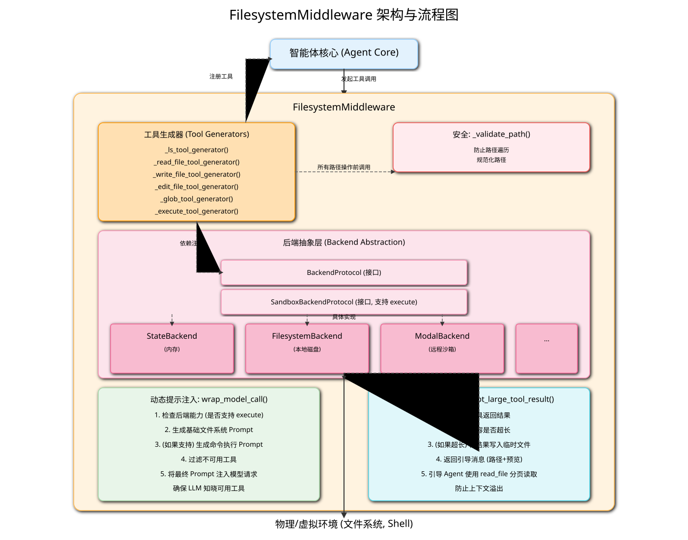

# FilesystemMiddleware 深度解析

## 1. 核心功能与定位

`FilesystemMiddleware` 是 `deepagents` 框架中的一个核心中间件，其主要职责是为智能体（Agent）提供一套功能完备、安全可靠的工具集，用于与各种形式的文件系统进行交互。它不仅仅是简单的文件操作封装，更是一个高度抽象、可扩展的架构层，允许智能体在不同后端（如内存、本地磁盘、远程沙箱）之间无缝切换，执行文件读写、搜索、甚至是命令执行等任务。

**核心定位**：将智能体的“意图”（如“读取这个文件”）与底层文件系统的“具体实现”解耦，并在此过程中注入安全、动态和高效的特性。

## 2. 架构设计

`FilesystemMiddleware` 的架构设计精良，体现了多个优秀的设计模式。

*(上图的 SVG 文件将一并提供)*

### 2.1. 后端抽象 (`BackendProtocol`)

这是该中间件架构的基石。它定义了一个标准接口 (`BackendProtocol` 和 `SandboxBackendProtocol`)，所有具体的文件系统实现都必须遵守这个接口。这种设计带来了极大的灵活性：

-   **`StateBackend`**: 一个基于内存的后端，用于临时的、无持久化的文件操作。数据存储在智能体的状态（State）中，随会话结束而消失。
-   **`StoreBackend` / `FilesystemBackend`**: 直接与本地物理文件系统交互，实现持久化存储。
-   **`SandboxBackendProtocol`**: 这是一个更特殊的接口，继承自 `BackendProtocol`，额外定义了 `execute` 方法。任何实现了该接口的后端（如 `ModalBackend`, `DaytonaBackend`）都表明自己支持在一个隔离的沙箱环境中执行 shell 命令。

通过依赖这个抽象接口而非具体实现，`FilesystemMiddleware` 的工具可以与任何兼容的后端协同工作。

### 2.2. 工具生成器模式

代码中包含一系列 `_..._tool_generator` 函数（如 `_read_file_tool_generator`）。这是一种工厂模式的应用，每个函数负责生成一个具体的工具（如 `read_file` Tool）。这样做的好处是：

-   **配置化**：可以在生成工具时传入特定配置，如自定义的工具描述。
-   **逻辑内聚**：每个工具的创建逻辑（包括同步和异步实现）被封装在各自的生成器函数中，使得代码结构清晰，易于维护。
-   **依赖注入**：生成器将 `backend` 作为参数，实现了将后端的依赖注入到每个工具中。

### 2.3. 动态提示注入 (`wrap_model_call`)

这是中间件与 LLM 交互的核心。`wrap_model_call` 方法会在模型每次被调用前执行，它动态地构建和注入系统提示（System Prompt）。

-   **基础提示**：首先注入 `FILESYSTEM_SYSTEM_PROMPT`，告诉模型有哪些基本的文件操作工具可用。
-   **条件提示**：它会检查后端是否支持 `SandboxBackendProtocol`。如果支持，它才会将 `execute` 工具暴露给模型，并同时注入 `EXECUTION_SYSTEM_PROMPT`，告知模型如何使用命令执行工具。

这种机制确保了模型只会看到当前环境下真正可用的工具，避免了因环境能力差异导致的幻觉或错误。

### 2.4. 安全路径验证 (`_validate_path`)

所有涉及文件路径的操作都会经过 `_validate_path` 函数的处理。这是一个至关重要的安全层，功能包括：

-   **防止路径遍历**：拒绝任何包含 `..` 或 `~` 的路径，杜绝了访问上级目录或用户主目录的风险。
-   **规范化路径**：将路径统一转换为以 `/` 开头的 Unix 风格绝对路径，屏蔽了操作系统的差异。
-   **拒绝 Windows 绝对路径**：明确不支持 `C:\...` 格式，保证了在虚拟文件系统环境中的路径一致性。

## 3. 关键方法/工具详解

`FilesystemMiddleware` 为智能体提供了一系列功能强大的工具：

-   **`ls(path: str)`**: 列出指定目录下的文件和目录。
-   **`read_file(file_path: str, offset: int = 0, limit: int = 500)`**: 读取文件内容。其设计充分考虑了大型文件，通过 `offset` 和 `limit` 参数支持分页读取，这是防止超出 LLM 上下文窗口限制的关键特性。
-   **`write_file(file_path: str, content: str)`**: 创建或覆写一个新文件。
-   **`edit_file(file_path: str, old_string: str, new_string: str, replace_all: bool = False)`**: 在文件中进行精确的字符串替换。它要求在编辑前必须先读取文件，并通过 `replace_all` 参数控制是替换第一个匹配项还是所有匹配项。
-   **`glob(pattern: str, path: str = "/")`**: 使用通配符模式（如 `**/*.py`）查找文件，是代码库探索的利器。
-   **`grep(pattern: str, path: str, glob: str, output_mode: str)`**: 在文件中搜索文本内容。支持按目录、文件模式过滤，并能以不同格式（仅文件名、内容、计数）返回结果。
-   **`execute(command: str)` (条件性提供)**: 在沙箱环境中执行 shell 命令。这是最高级的工具，只有在后端实现了 `SandboxBackendProtocol` 时才可用。它返回命令的输出和退出码。

## 4. 大尺寸工具结果处理 (`_intercept_large_tool_result`)

这是一个非常智能和重要的特性，旨在解决工具输出内容过大（例如，`read_file` 读取了一个巨大的文件，或 `execute` 运行了一个产生大量日志的命令）而撑爆 LLM 上下文窗口的问题。

其工作流程如下：

1.  **拦截**：`wrap_tool_call` 方法会拦截所有非文件系统工具的返回结果。
2.  **检查大小**：判断返回的 `ToolMessage` 内容长度是否超过预设的阈值 (`tool_token_limit_before_evict`)。
3.  **写入临时文件**：如果内容过大，中间件会调用后端（Backend）的 `write` 方法，将这个巨大的字符串内容保存到一个临时的虚拟路径下（如 `/large_tool_results/<tool_call_id>`)。
4.  **返回引导消息**：替换原始的巨大结果，返回一条格式化的消息给智能体。这条消息包含：
    -   一个提示，告知结果太大已被保存。
    -   保存结果的**文件路径**。
    -   一个简短的**内容预览**（如前 10 行）。
    -   明确的**指示**，引导智能体使用 `read_file` 工具并配合分页参数（`offset`, `limit`）来分块读取这个结果文件。

这个机制极大地增强了智能体处理复杂任务的鲁棒性，使其能够优雅地处理和分析海量数据。
