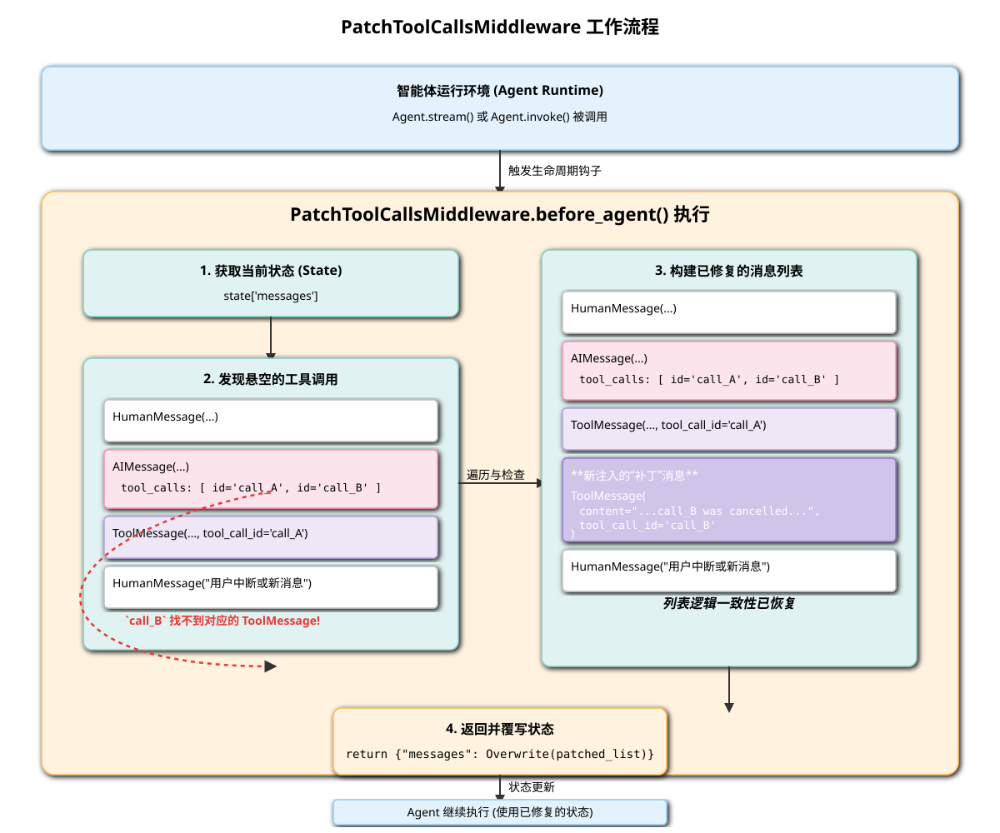

# PatchToolCallsMiddleware 深度解析

## 1. 核心功能与定位

`PatchToolCallsMiddleware` 是 `deepagents` 框架中的一个**健壮性与稳定性中间件**。它的功能非常专一且重要：**修复消息历史中的“悬空工具调用”（Dangling Tool Calls）**。

在复杂的智能体交互中，可能会出现这样一种情况：
1.  LLM（以 `AIMessage` 的形式）决定发起一个或多个工具调用（`tool_calls`）。
2.  在这些工具调用尚未执行并返回结果（`ToolMessage`）之前，一个新的消息（可能是用户输入、系统中断或其他事件）插入到了消息历史中。
3.  这导致最初的 `AIMessage` 中的 `tool_calls` 永远不会有对应的 `ToolMessage` 来响应它们。它们就像是被“遗忘”或“悬挂”在那里。

这种“悬空”状态会对后续的 LLM 推理造成困扰。当 LLM 再次观察消息历史时，它会看到一个它自己曾经发出但从未得到回应的指令，这可能会导致它产生困惑、重复尝试或作出错误的判断。

**核心定位**：作为智能体状态的“清理器”，确保消息历史的**逻辑一致性**。它在每次智能体运行循环开始前，自动为所有悬空的工具调用提供一个明确的“已取消”状态，从而消除二义性，保证 LLM 总是在一个清晰、一致的上下文中做决策。

## 2. 架构设计与工作流程

该中间件的设计非常简洁，它利用了 `AgentMiddleware` 的生命周期钩子，在最合适的时机介入并修正状态。

*(上图的 SVG 文件将一并提供)*

### 2.1. `before_agent` 生命周期钩子

`PatchToolCallsMiddleware` 的所有逻辑都实现在 `before_agent` 方法中。这个方法会在智能体（Agent）的主运行循环（`stream()` 或 `invoke()`）开始执行其内部逻辑（如图的构建、模型调用等）**之前**被调用。

选择这个时机是该设计的关键：
-   **抢先修复**：它确保了在 LLM 即将看到消息历史（`state["messages"]`）并进行下一次推理之前，历史记录已经被“打扫干净”。
-   **状态访问**：此时，它可以完整地访问到当前的所有消息历史 `state["messages"]`。
-   **状态修改**：`before_agent` 钩子允许返回一个字典来更新状态。这是它能够“修复”历史记录的机制基础。

### 2.2. 工作流程详解

当 `before_agent` 被触发时，它会执行以下步骤：

1.  **获取消息历史**：从 `state` 中获取 `messages` 列表。
2.  **遍历消息**：逐一检查列表中的每条消息。
3.  **识别 `AIMessage`**：如果当前消息是 `AIMessage` 并且包含了 `tool_calls` 列表，那么它就是一个需要被检查的潜在“悬空”源头。
4.  **寻找对应的 `ToolMessage`**：对于 `AIMessage` 中的**每一个** `tool_call`，中间件会从**当前位置向后**扫描整个消息历史，试图找到一个具有相同 `tool_call_id` 的 `ToolMessage`。
5.  **判断悬空**：如果在后续的消息中**找不到**对应的 `ToolMessage`，那么这个 `tool_call` 就被确认为“悬空”。
6.  **创建补丁消息 (`ToolMessage`)**:
    -   对于每一个悬空的 `tool_call`，中间件会**动态地创建一个新的 `ToolMessage`**。
    -   这个“补丁”消息的内容是一条明确的、信息丰富的字符串，例如：`"Tool call <tool_name> with id <tool_id> was cancelled - another message came in before it could be completed."`
    -   关键在于，这个新创建的 `ToolMessage` 会被赋予与悬空 `tool_call` **完全相同的 `tool_call_id`**。
7.  **注入补丁**：将原始消息和所有新创建的“补丁” `ToolMessage` 添加到一个新的 `patched_messages` 列表中。
8.  **覆写状态**：
    -   完成遍历后，中间件会返回一个字典：`{"messages": Overwrite(patched_messages)}`。
    -   `Overwrite` 是一个特殊的 langgraph 类型，它指示运行时用 `patched_messages` 列表**完全替换**原始的 `messages` 列表，而不是追加。

## 3. 关键方法详解

-   **`before_agent(self, state: AgentState, ...)`**:
    -   这是该中间件的唯一核心方法。
    -   `state: AgentState`: 接收当前的智能体完整状态，这是它的数据来源。
    -   **返回值 `dict | None`**: 如果没有发现任何悬空调用，它可以返回 `None` 表示不修改状态。如果发现并修复了悬空调用，它必须返回一个包含更新后 `messages` 列表的字典，以触发状态的覆写。

## 4. 意义与价值

虽然代码量很小，但 `PatchToolCallsMiddleware` 的价值巨大：
-   **提高鲁棒性**：它优雅地处理了并发和异步交互中可能出现的边缘情况，防止了智能体因状态不一致而陷入混乱。
-   **增强可预测性**：确保了 LLM 的输入（消息历史）总是逻辑闭环的，使得模型的行为更加稳定和可预测。
-   **解耦关注点**：将“状态清理”这个关注点从核心的智能体逻辑中分离出来，使得主逻辑可以更专注于任务本身，而无需担心这种底层的状态一致性问题。

总而言之，`PatchToolCallsMiddleware` 是一个典型的“幕后英雄”组件，它不直接参与任务执行，但通过维护一个干净、一致的运行环境，为整个智能体系统的稳定运行提供了不可或缺的保障。
