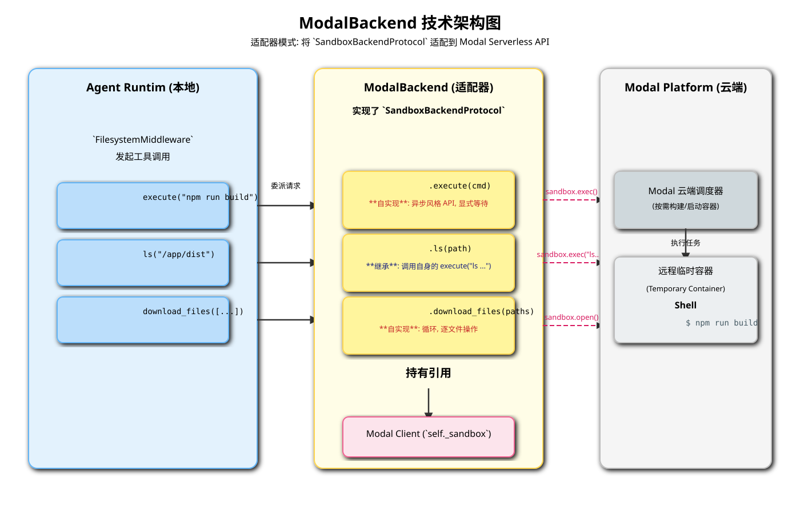

# ModalBackend 深度解析

`ModalBackend` 是 `BaseSandbox` 的另一个具体实现，它将 `deepagents` 框架与 [Modal](https://modal.com/) serverless 计算平台集成在一起。`ModalBackend` 的目标是让智能体（Agent）能够在一个由 Modal 管理的、按需启动的、临时的远程容器化环境中执行命令和操作文件。

## 1. 核心定位与优势

-   **Serverless 执行**: Modal 是一个 Serverless 平台，环境的启动、扩展和关闭都是按需自动管理的。这意味着 Agent 可以在一个干净、隔离的环境中执行任务，而无需手动管理服务器或容器的生命周期。
-   **临时性与隔离性**: 每个 Modal `Sandbox` 都是一个临时的会话。这为执行不可信代码或运行有副作用的命令提供了极高的安全性，因为任务完成后整个环境可以被彻底销毁。
-   **依赖管理**: Modal 允许在定义环境时声明详细的 Python 库和系统依赖，确保 Agent 的任务总是在一个具有正确依赖的、可复现的环境中运行。

## 2. 技术架构

`ModalBackend` 的架构同样是一个**适配器模式**，将 `SandboxBackendProtocol` 接口适配到 Modal 客户端库 (`modal.Sandbox`) 的接口上。

*(上图的 SVG 文件将一并提供)*

其关键组件包括：

1.  **Agent Core**: 智能体核心，发出工具调用请求。
2.  **`ModalBackend` 实例**:
    -   持有 `modal.Sandbox` 客户端实例的引用 (`self._sandbox`)。
    -   实现了 `SandboxBackendProtocol` 接口。
3.  **`modal.Sandbox` (Modal 客户端)**:
    -   这是与 Modal 平台交互的底层客户端，代表一个正在运行的远程沙箱会话。
    -   它暴露了 `exec`（执行命令）和 `open`（文件操作）等核心方法。
4.  **Modal Platform (云端)**:
    -   Modal 的云端基础设施，负责接收客户端请求，按需构建和启动容器，并在容器内执行指定的任务。
5.  **远程临时容器 (Sandbox)**:
    -   一个在 Modal 云上运行的临时容器。这是命令的实际执行和文件的临时存储位置。

## 3. 关键方法实现

与 `DaytonaBackend` 相比，`ModalBackend` 在实现细节上有一些显著差异。

### 3.1. `execute(self, command: str) -> ExecuteResponse`

-   这是 `ModalBackend` **最核心的自实现方法**。
-   **异步风格的 API**: 它通过 `self._sandbox.exec("bash", "-c", command, ...)` 启动一个远程进程。这个调用本身可能是非阻塞的。
-   **显式等待**: 代码随后必须调用 `process.wait()` 来阻塞并等待远程进程执行完成。
-   **分开的 I/O 流**: 与 Daytona 将 stdout/stderr 合并不同，Modal 的 API 分别提供了 `process.stdout` 和 `process.stderr`。`ModalBackend` 的实现负责分别读取这两个流，然后将它们合并成一个单一的输出字符串，以符合 `ExecuteResponse` 的格式要求。
-   **返回结果**: 最后，它从 `process` 对象中获取 `returncode`，并将所有信息包装成 `ExecuteResponse` 返回。

### 3.2. 文件操作 (继承自 `BaseSandbox`)

-   和 `DaytonaBackend` 一样，`ModalBackend` 也**默认继承**了 `BaseSandbox` 中基于 `execute` 实现的标准文件操作（`read`, `write`, `ls`, `glob`, `grep`, `edit`）。
-   这意味着，一个 `modal_backend.ls("/app")` 的调用，最终会转化为一个 `modal_backend.execute("ls /app")` 命令，在远程的 Modal 容器中执行。

### 3.3. 文件传输 (逐个操作，无批量优化)

-   `ModalBackend` **覆盖**了 `download_files` 和 `upload_files` 方法，但其实现方式与 `DaytonaBackend` 完全不同。
-   **`download_files(paths)`**:
    -   它通过一个简单的 **`for` 循环**来遍历所有需要下载的文件路径。
    -   在循环内部，它使用 `with self._sandbox.open(path, "rb") as f:` 来打开远程文件，然后调用 `f.read()` 读取内容。
    -   这是一个**逐文件串行**的操作。
-   **`upload_files(files)`**:
    -   同样，它也是通过一个 `for` 循环，逐个使用 `self._sandbox.open(path, "wb")` 打开并写入文件。

-   **性能考量**: 这种实现方式简单直观，但**缺少批量优化**。当需要传输大量小文件时，多次独立的 API 调用所带来的网络延迟累加起来，可能会导致其性能显著低于使用原生批量 API 的 `DaytonaBackend`。注释也明确指出，它所依赖的 Modal 文件 API 尚处于早期阶段。

## 4. 总结

`ModalBackend` 提供了一种将 Agent 的计算任务 Serverless 化的强大方式。它特别适用于那些需要干净、隔离、临时且具有复杂依赖环境的计算任务。Agent 可以按需“召唤”一个具备特定能力的云环境来完成工作，然后在任务结束后让环境自动消失。

虽然其当前的文件传输实现没有进行批量优化，但这更多地反映了其所依赖的底层 Modal API 的现状。其核心的 `execute` 实现清晰地展示了如何适配一个具有异步风格和分离 I/O 流的远程执行 API，是 `BaseSandbox` 灵活性的又一个有力证明。
