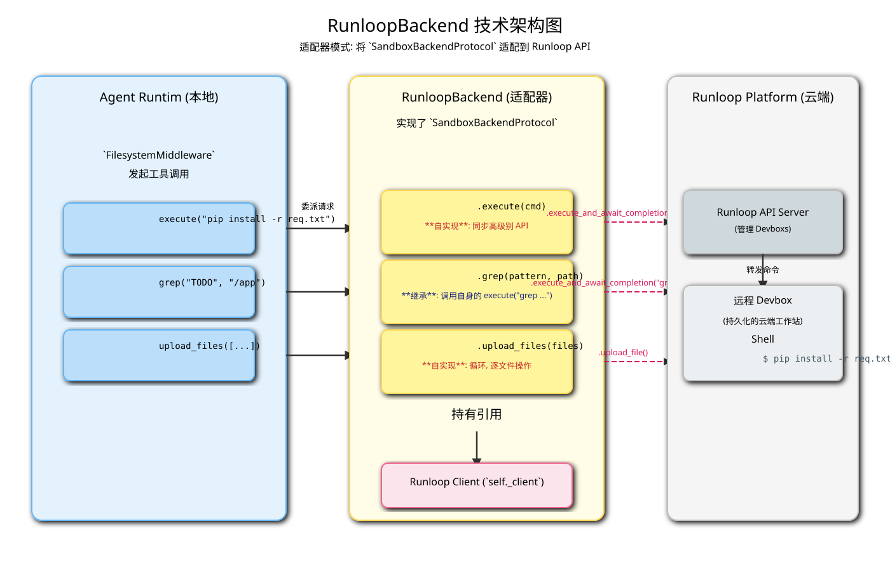

# RunloopBackend 深度解析

`RunloopBackend` 是 `BaseSandbox` 的第三个具体实现，它负责将 `deepagents` 框架与 [Runloop](https://runloop.com/) 平台连接起来。Runloop 提供的是一种“云端开发环境”（Devbox）服务，类似于一个持久化的、始终在线的云端工作站。`RunloopBackend` 让智能体（Agent）能够在这个远程的、持久化的开发环境中执行命令和操作文件。

## 1. 核心定位与优势

-   **持久化云端工作站**: 与 Modal 的临时容器不同，Runloop 的 Devbox 是持久化的。这意味着 Agent 可以在多次交互之间保持文件系统的状态、已安装的依赖和正在运行的进程。这对于需要长期上下文或复杂环境设置的开发任务非常有利。
-   **远程一致环境**: 类似于 Daytona，它提供了一个标准化的远程开发环境，确保 Agent 和人类开发者在相同的环境中工作。
-   **API 驱动交互**: 所有操作都通过 `runloop_api_client` 与 Runloop 的后端服务进行通信，保证了操作的稳定性和安全性。

## 2. 技术架构

`RunloopBackend` 的架构同样是**适配器模式**，将 `SandboxBackendProtocol` 接口适配到 `runloop_api_client` 的特定接口上。

*(上图的 SVG 文件将一并提供)*

其关键组件包括：

1.  **Agent Core**: 智能体核心。
2.  **`RunloopBackend` 实例**:
    -   持有 `runloop_api_client.Runloop` 客户端实例的引用 (`self._client`)。
    -   在构造时负责初始化这个客户端（如果用户没有直接提供的话），通过 API Key（来自参数或环境变量 `RUNLOOP_API_KEY`）进行认证。
    -   实现了 `SandboxBackendProtocol` 接口。
3.  **`runloop_api_client.Runloop` (Runloop 客户端)**:
    -   与 Runloop 后端 API 通信的底层库。
    -   它通过 `devboxes` 属性暴露与特定云端开发环境（Devbox）交互的方法。
4.  **Runloop Platform (云端)**:
    -   Runloop 的云端基础设施，管理着所有用户的 Devbox 实例。
5.  **远程 Devbox (云端工作站)**:
    -   一个持久化的、运行中的容器或虚拟机，是命令和文件操作的实际执行地点。

## 3. 关键方法实现

### 3.1. `execute(self, command: str) -> ExecuteResponse`

-   这是 `RunloopBackend` **核心的自实现方法**。
-   **同步高级别 API**: 它调用了一个名为 `self._client.devboxes.execute_and_await_completion(...)` 的方法。这是一个非常高级别的、同步的（阻塞式）API。
-   **原子操作**: 从 Agent 的角度看，这个调用是一个原子操作。`RunloopBackend` 发出请求，Runloop 平台负责在远程执行命令、等待其完成、收集所有输出，然后将最终结果一次性返回。
-   **I/O 合并**: 与 `ModalBackend` 类似，Runloop API 也是分别返回 `stdout` 和 `stderr`。`RunloopBackend` 负责将这两个输出流合并成一个字符串，以符合 `ExecuteResponse` 的要求。

### 3.2. 文件操作 (继承自 `BaseSandbox`)

-   `RunloopBackend` **默认继承**了 `BaseSandbox` 中基于 `execute` 实现的所有标准文件操作方法（`read`, `write`, `ls`, `grep`, `edit` 等）。
-   这意味着，一个 `runloop_backend.read("/home/user/README.md")` 的调用，最终会转化为一个 `runloop_backend.execute("cat /home/user/README.md")` 命令，在远程的 Runloop Devbox 中执行。

### 3.3. 文件传输 (逐个操作，无批量优化)

-   `RunloopBackend` **覆盖**了 `download_files` 和 `upload_files` 方法，其实现方式与 `ModalBackend` 非常相似。
-   **`download_files(paths)`**:
    -   通过一个 **`for` 循环**遍历所有需要下载的文件路径。
    -   在循环内部，调用 `self._client.devboxes.download_file(self._devbox_id, path=path)` 来获取单个文件。这个方法返回一个二进制响应对象，需要调用 `.read()` 来获取内容的字节。
-   **`upload_files(files)`**:
    -   同样是通过一个 `for` 循环，逐个调用 `self._client.devboxes.upload_file(..., file=content)` 来上传文件。

-   **性能考量**: 与 `ModalBackend` 一样，这种逐文件串行操作的方式在需要传输大量小文件时，可能会因为累积的网络延迟而导致性能瓶颈。

## 4. 总结

`RunloopBackend` 为 `deepagents` 提供了一种与持久化云端开发环境交互的能力。它非常适合那些需要在一个稳定、连续的会话中完成的复杂开发任务，例如需要先安装依赖、然后编译代码、最后运行测试的场景。

它的 API 风格（高级别、同步执行）使得 `execute` 的实现非常简洁明了。虽然文件传输没有批量优化，但对于其核心应用场景——在已经配置好的环境中运行命令——`RunloopBackend` 提供了一个稳定而强大的执行后端。
