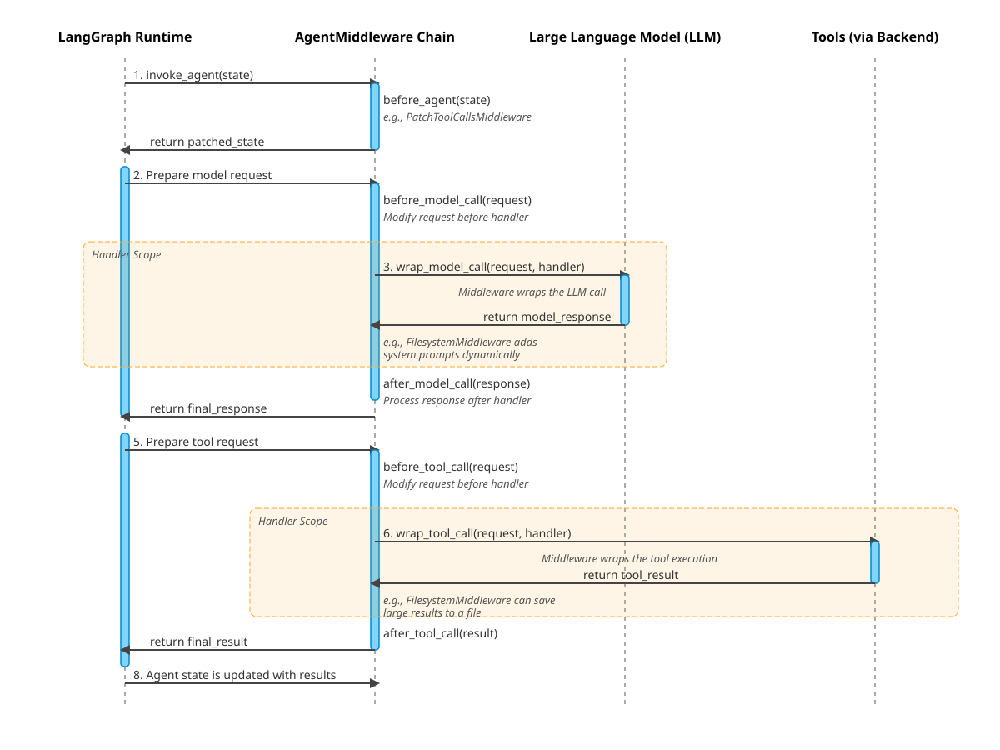

# Deep Agents 技术白皮书: `deepagents` 核心与 `deepagents-cli` 应用深度解析

本文档旨在提供一份全面、深入的技术解析，涵盖 `deepagents` 核心框架的设计哲学、架构模式，以及 `deepagents-cli` 作为其参考应用的具体实现。

## 目录

1.  [**第一部分：`deepagents` 核心框架解析**](#part-1)
    1.1. [核心设计哲学：组合、协议与动态配置](#1-1-core-philosophy)
    1.2. [整体架构：工厂、中间件与后端](#1-2-overall-architecture)
    1.3. [深度解析：中间件生命周期](#1-3-middleware-lifecycle)
    1.4. [深度解析：沙箱与后端协议](#1-4-sandbox-and-backend-protocol)
2.  [**第二部分：`deepagents-cli` 应用实现**](#part-2)
    2.1. [应用层：CLI 入口与会话管理](#2-1-application-layer)
    2.2. [核心中间件实现与协同工作](#2-2-core-middleware-in-action)
    2.3. [高级功能：技能的渐进式披露](#2-3-progressive-disclosure)
    2.4. [提示工程：动态与分层的指令构建](#2-4-prompt-engineering)

---

## 第一部分：`deepagents` 核心框架解析

`deepagents` 是一个高度模块化、可组合的智能体（Agent）框架，其设计核心并非要从零开始构建一个全新的智能体运行时，而是要成为一个强大的**“智能体组装工厂”**。它巧妙地构建在业界领先的 LangChain 和 LangGraph 库之上，通过引入强大的中间件和后端抽象，提供了一套用于快速构建、扩展和部署复杂智能体的 opinionated（有明确主张的）工具集。

### 1.1. 核心设计哲学：组合、协议与动态配置

-   **组合优于继承 (Composition over Inheritance)**: 框架的核心功能不是通过继承一个巨大的 `Agent` 基类来实现的，而是通过将一系列独立的、可复用的**中间件 (Middleware)** 动态地“组合”到一个轻量级的 Agent 核心上。每个中间件负责一个正交的功能（文件系统、技能、子任务委派等），使得系统易于理解、维护和扩展。

-   **协议驱动开发 (Protocol-Oriented Development)**: 框架通过定义清晰的接口协议（`BackendProtocol`, `SandboxBackendProtocol`）来解耦“意图”与“执行”。智能体的工具（如 `read_file`）只依赖于这些抽象协议，而无需关心底层的具体实现。这使得智能体可以无缝地在不同执行环境（内存、本地文件系统、远程沙箱）之间切换，只需在创建时注入不同的后端实现即可。这是一种典型的**策略模式 (Strategy Pattern)** 和**依赖注入 (Dependency Injection)** 的应用。

-   **动态配置与情境感知 (Dynamic Configuration & Context-Awareness)**: 智能体的能力和行为不是静态的，而是在运行时根据当前环境和状态**动态构建**的。最典型的例子是，框架会通过 `wrap_model_call` 生命周期钩子，在每次调用 LLM 前检查后端的能力，然后动态地修改系统提示和可用的工具列表，确保 LLM 的“世界观”与其实际能力完全一致。

### 1.2. 整体架构：工厂、中间件与后端

`deepagents` 的宏观架构可以分为两个大的逻辑区域：`deepagents` 核心框架（一个可重用的 Python 库）和 `deepagents-cli` 应用（一个具体的使用案例）。

上图清晰地展示了这种分离：

-   **`deepagents` (核心框架)**:
    -   **Agent (`graph.py`)**: 框架的核心是一个名为 `create_deep_agent` 的**工厂函数**。它接收模型、工具、中间件和后端等“原材料”，然后利用 LangChain 的 `create_agent` 函数将它们组装成一个功能完备的、基于 LangGraph 的可执行图 (Pregel)。
    -   **AgentMiddleware (抽象中间件)**: 定义了中间件必须遵循的接口，包含一系列生命周期钩子（如 `before_agent`, `wrap_model_call`），允许开发者在 Agent 执行流程的关键节点注入自定义逻辑。
    -   **Sandbox (沙箱抽象)**: 定义了 `BackendProtocol` 和 `SandboxBackendProtocol`，这是实现环境解耦的关键。

-   **`deepagents-cli` (应用实现)**:
    -   **CLI Application**: 负责用户交互、命令解析和 UI 渲染。
    -   **Middleware Implementations**: 提供了一系列具体的中间件实现，如 `SkillsMiddleware` 和 `SubAgentMiddleware`，它们实现了 `deepagents` 核心框架中定义的 `AgentMiddleware` 接口。
    -   **Sandbox Backend Implementations**: 提供了具体的后端实现，如 `DaytonaBackend` 和 `RunloopBackend`，它们实现了 `SandboxBackendProtocol` 接口。

整个系统的控制流始于用户，通过 CLI 应用组装好 `deepagents` 核心框架定义的各个组件，然后驱动 Agent 核心完成任务。

### 1.3. 深度解析：中间件生命周期

中间件是框架的灵魂。理解其生命周期钩子如何按顺序触发，是理解框架如何工作的关键。

如上图所示，一个典型的 Agent 执行周期会按以下顺序触发中间件钩子：

1.  **`before_agent(state)`**: 在 Agent 运行循环开始时，但在任何核心逻辑（如模型调用）之前触发。这是**准备和校验 Agent 状态**的阶段。例如，`PatchToolCallsMiddleware` 在此阶段修复消息历史，`SkillsMiddleware` 则在此阶段从文件系统加载技能元数据到状态中。

2.  **`before_model_call(request)`**: 在调用 `wrap_model_call` 包装器之前，允许对即将发送给模型的请求进行初步修改。

3.  **`wrap_model_call(request, handler)`**: 这是最核心的钩子之一。它**包装**了对 LLM 的实际调用。在此阶段，中间件可以根据当前状态动态地**构建和注入系统提示**、**过滤工具**。例如，`FilesystemMiddleware` 会检查后端能力并动态地告知 LLM `execute` 工具是否可用。

4.  **`after_model_call(response)`**: 在 LLM 调用完成之后，但在 Agent 核心逻辑处理其响应之前触发，允许对模型返回的响应进行后处理。

5.  **`before_tool_call(request)`** & **`wrap_tool_call(request, handler)`**: 与模型调用类似，这两个钩子包装了对工具的实际调用。这为拦截和处理工具的输入输出提供了机会。例如，`FilesystemMiddleware` 在 `wrap_tool_call` 中拦截过大的工具输出，将其存入文件并返回引导消息，以防止上下文窗口溢出。

6.  **`after_tool_call(result)`**: 在工具调用完成之后触发。

通过这个精心设计的生命周期，`deepagents` 将复杂的功能逻辑分解到各个独立的中间件中，并通过一个定义良好的调用链将它们串联起来，实现了高度的模块化和可维护性。

### 1.4. 深度解析：沙箱与后端协议

沙箱和后端协议是 `deepagents` 实现安全、可移植执行环境的基石。其架构设计巧妙地运用了**模板方法模式 (Template Method Pattern)** 和**策略模式 (Strategy Pattern)**。

-   **`BackendProtocol` & `SandboxBackendProtocol` (策略接口)**:
    -   `BackendProtocol` 定义了所有文件系统操作的接口（`read`, `write`, `ls` 等）。
    -   `SandboxBackendProtocol` 继承前者并增加了 `execute` 接口，专门用于执行 Shell 命令。
    -   这两个协议共同构成了“策略接口”，任何实现了这些接口的类都可以被视为一个可替换的执行环境“策略”。

-   **`BaseSandbox` (抽象模板)**:
    -   这是一个实现了 `BackendProtocol` 的抽象基类。它为**大部分文件操作提供了默认实现**，但将最核心的 `execute` 方法声明为抽象方法。
    -   其默认实现非常巧妙：它将所有文件操作（如 `read(path)`) **翻译**成一个等效的 Shell 命令 (e.g., `cat {path}`), 然后调用 `self.execute(...)` 来执行。
    -   这正是**模板方法模式**的体现：`BaseSandbox` 定义了文件操作的“算法骨架”（即转换为 Shell 命令并执行），但将具体的执行步骤（`execute`）延迟到子类中实现。

-   **具体后端 (具体策略)**:
    -   如 `DaytonaBackend`, `ModalBackend`, `RunloopBackend` 等。
    -   它们都继承自 `BaseSandbox` 并提供了各自环境中 `execute` 方法的具体实现。例如，`DaytonaBackend` 通过 Daytona API 与远程开发环境通信，`RunloopBackend` 则在本地启动一个子进程。
    -   由于继承了 `BaseSandbox`，它们**自动获得了**所有文件操作的能力，极大地简化了新后端的集成工作。

这种设计使得 `FilesystemMiddleware` 可以完全与具体环境解耦。它只需要依赖 `BackendProtocol` 接口，就可以在运行时被注入任何具体的后端“策略”，从而实现智能体在不同环境下的无缝切换。

---

## 第二部分：`deepagents-cli` 应用实现

`deepagents-cli` 是 `deepagents` 核心框架的一个强大应用实例。它展示了如何利用核心框架的组件来构建一个功能丰富的、面向开发者的命令行代码助手。

### 2.1. 应用层：CLI 入口与会话管理

-   **入口 (`main.py`)**: 应用的生命周期始于 `cli_main()` 函数。它使用 `Typer` 解析命令行参数，并使用 `Rich` 库来提供美观的 UI 渲染。
-   **Agent 组装 (`agent.py`)**: `create_cli_agent()` 函数是 `deepagents-cli` 的“总装车间”。它负责：
    1.  根据命令行参数实例化具体的**后端** (如 `DaytonaBackend`)。
    2.  实例化所有需要的**中间件** (如 `SkillsMiddleware`, `SubAgentMiddleware`)。
    3.  调用核心框架的 `create_deep_agent()` 工厂函数，将这些部件组装成一个可执行的 LangGraph 实例。
-   **执行循环 (`execution.py`)**: `execute_task()` 函数负责驱动 Agent 完成任务。它调用 `agent.astream()` 来流式地执行 LangGraph，并处理各种事件，如渲染 LLM 的文本输出、处理工具调用、以及在需要时暂停以等待用户批准（人机回路）。

上图详细描绘了一个请求从用户输入到最终返回的完整端到端流程，展示了 `deepagents-cli` 各个组件之间是如何协同工作的。

### 2.2. 核心中间件实现与协同工作

`deepagents-cli` 的强大功能主要来自于其实现的三大核心中间件：

-   **`FilesystemMiddleware`**: 负责提供与“世界”交互的基础 I/O 和执行能力。它是 Agent 的**“手和脚”**，提供了 `ls`, `read_file`, `execute` 等基础工具。

-   **`SkillsMiddleware`**: 负责为 Agent 提供可复用的、结构化的“知识”和“工作流程”。它是 Agent 的**“知识库”或“操作手册”**。它并不直接提供工具，而是教会 Agent 如何通过读取 `SKILL.md` 文件来学习和执行复杂任务。

-   **`SubAgentMiddleware`**: 负责提供任务分解、委派和并发执行的能力。它是 Agent 的**“项目管理和委派能力”**，通过一个 `task` 工具来创建隔离的、专用的子智能体去完成复杂任务。

这三者协同工作，形成了一个强大的能力矩阵。例如，主 Agent 可以通过 `SubAgentMiddleware` 将一个复杂的编码任务委派给子 Agent。子 Agent 启动后，通过 `SkillsMiddleware` 发现并学习了相关的编码技能，然后使用 `FilesystemMiddleware` 提供的工具来读取代码、执行测试，最终完成任务。

### 2.3. 高级功能：技能的渐进式披露

“渐进式披露”是 `deepagents-cli` 最具创新性的上下文管理策略，由 `SkillsMiddleware` 实现。它解决了在拥有大量技能时如何避免上下文窗口溢出的核心问题。

其流程如下：

1.  **摘要阶段**: 在调用 LLM 前，`SkillsMiddleware` 仅将所有可用技能的**名称和简短描述**注入到系统提示中。
2.  **决策阶段**: LLM 根据任务和技能摘要，判断哪个技能最相关。
3.  **学习阶段**: LLM **主动生成**一个 `read_file` 工具调用，去读取该技能对应的 `SKILL.md` 文件的**完整内容**。
4.  **执行阶段**: 在获得了详细的、分步骤的指令后，LLM 才开始执行任务。

这个机制将“一次性加载所有知识”的模式，转变为“按需学习”的模式，极大地提高了上下文效率和系统的可扩展性。

### 2.4. 提示工程：动态与分层的指令构建

`deepagents-cli` 的提示工程并非依赖于一个巨大的静态 Prompt，而是通过中间件链在运行时**动态地、分层地构建**出来的。

-   **分层构建**: 每个中间件都负责向系统提示中添加自己那一部分的指令。`SkillsMiddleware` 添加技能摘要，`SubAgentMiddleware` 添加任务委派指南，`FilesystemMiddleware` 添加文件和执行工具的说明。
-   **基于能力的提示**: `FilesystemMiddleware` 只在后端支持执行时才添加 `execute` 工具的说明，确保提示与能力匹配。
-   **通过示例学习**: `SubAgentMiddleware` 的提示中包含了大量高质量的正反面示例，并附有“思维链”注释，这是一种极其有效的教会 LLM 如何进行复杂决策的方法。

这种动态、模块化、注重“教导而非命令”的提示工程策略，是 `deepagents-cli` 能够完成复杂、多步骤任务的核心驱动力。
