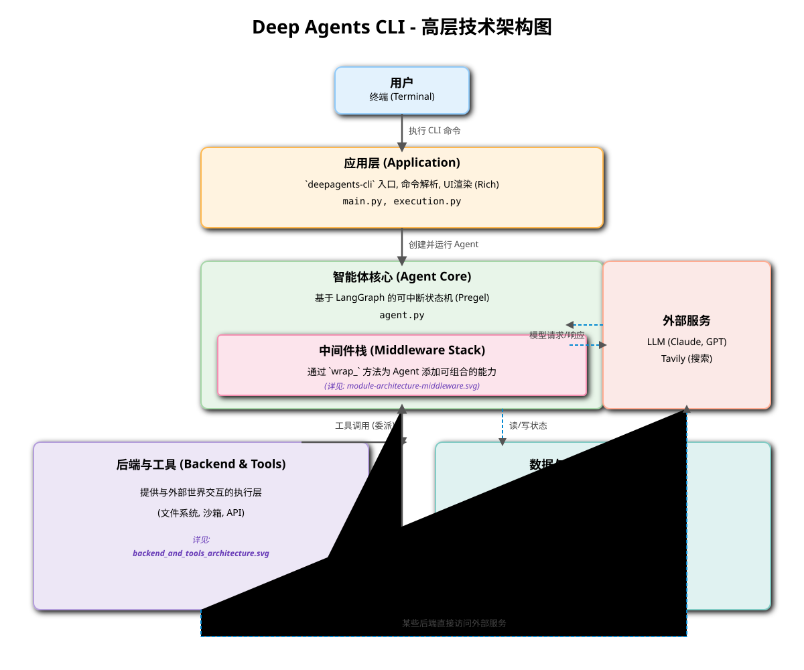
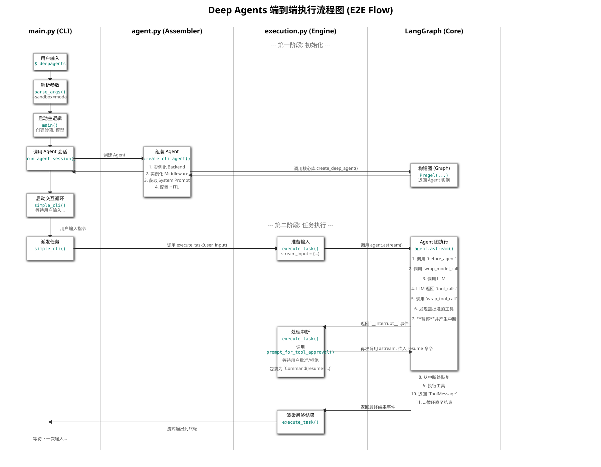
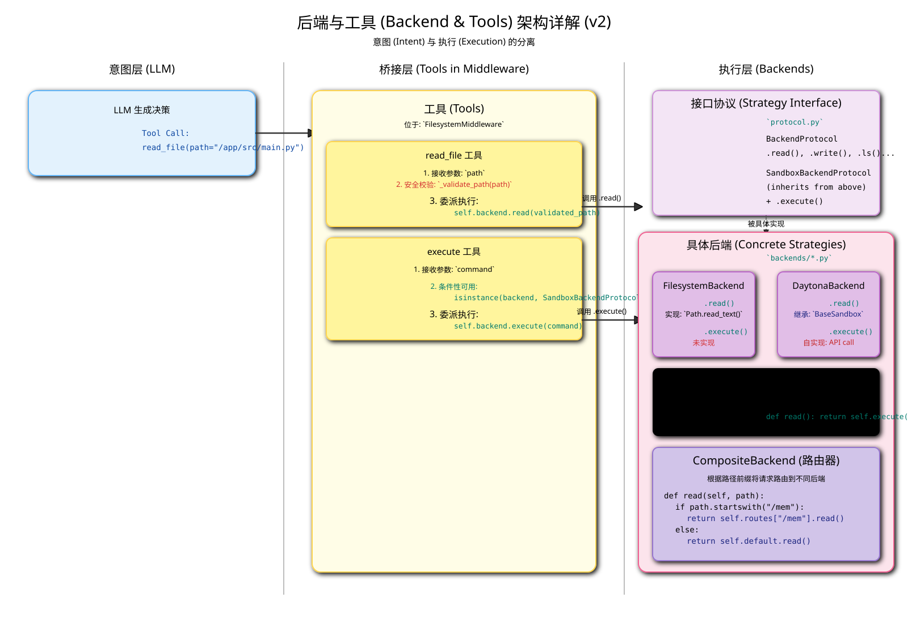
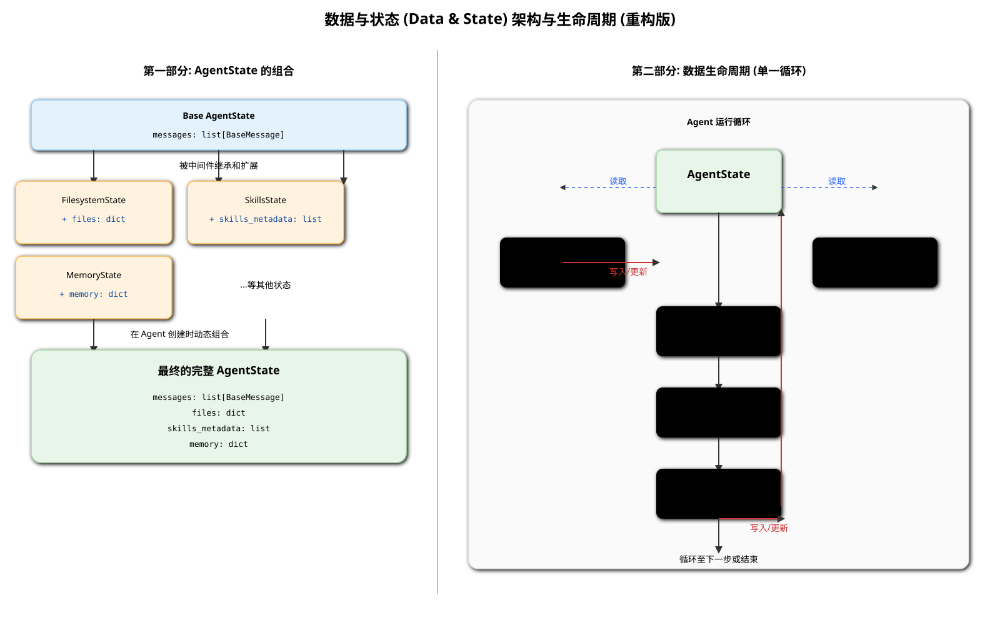
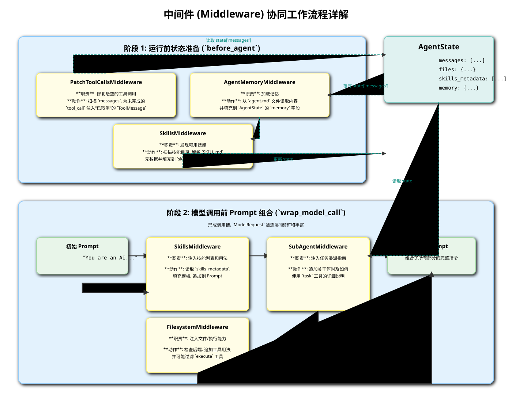
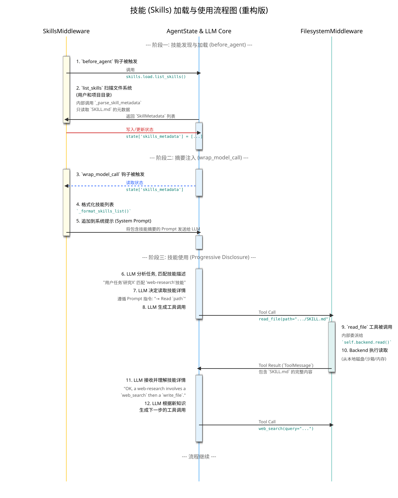
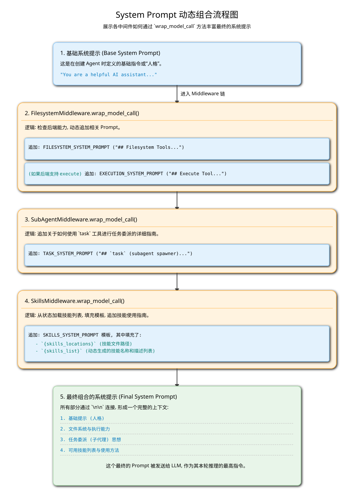

# `deepagents-cli` 技术架构文档

本文档深入分析了 `deepagents-cli` 工具的技术架构、核心概念和实现细节。

## 目录

1.  [整体架构](#1-整体架构)
2.  [核心概念](#2-核心概念)
3.  [中间件深入分析](#3-中间件深入分析)
4.  [沙箱环境深入分析](#4-沙箱环境深入分析)
5.  [高级功能](#5-高级功能)
6.  [提示工程](#6-提示工程)

---

### 1. 整体架构

`deepagents-cli` 的核心是一个基于 LangGraph 构建的、由中间件驱动的智能体。这种设计提供了高度的可扩展性和可组合性。

#### 1.1. 高层架构图

下图展示了系统的主要层次和组件之间的交互关系。

#### 1.2. 端到端规划流程

# Deep Agents 端到端执行流程详解 (E2E Flow)

本文档将从用户在命令行界面（CLI）输入一条指令开始，到智能体（Agent）最终返回结果为止，端到端地追踪一个请求在 `deepagents` 框架中的完整生命周期。我们将重点标注出每一步涉及的关键文件、类和方法。

## 流程概览

整个流程可以分为两大阶段：
1.  **初始化阶段 (Initialization)**: 从 CLI 启动到 Agent 完全配置好并准备就绪。
2.  **任务执行阶段 (Task Execution)**: 从接收用户输入到完成任务并流式输出结果。

*(上图的 SVG 文件将一并提供)*

---

## 第一阶段: 初始化 (Initialization)

### 1. CLI 入口与参数解析

-   **文件**: `main.py`
-   **函数**: `cli_main()` -> `parse_args()`
-   **流程**: 用户执行 `deepagents` 命令。`cli_main` 作为入口点被调用，它首先调用 `parse_args` 来解析命令行参数，例如 `--agent <name>`, `--sandbox <type>`, `--auto-approve` 等。这些参数决定了 Agent 的身份、执行环境和行为模式。

### 2. 主逻辑启动

-   **文件**: `main.py`
-   **函数**: `asyncio.run(main(...))`
-   **流程**: `cli_main` 将解析后的参数传递给 `main` 函数，并使用 `asyncio.run` 启动整个异步应用。

### 3. 环境与 Agent 会话设置

-   **文件**: `main.py`
-   **函数**: `main()` -> `_run_agent_session()`
-   **流程**:
    1.  `create_model()`: 根据配置创建 LLM 客户端实例。
    2.  `create_sandbox()`: **(条件性)** 如果用户指定了 `--sandbox`，此工厂函数会根据类型（如 "daytona"）实例化对应的沙箱后端（如 `DaytonaBackend`）。这是一个 `with` 上下文管理器，负责沙箱的生命周期（创建、清理）。
    3.  `_run_agent_session()`: 调用此核心函数来创建 Agent 并启动交互循环。

### 4. Agent 的创建与组装 (核心步骤)

-   **文件**: `agent.py`
-   **函数**: `_run_agent_session()` -> `create_cli_agent()`
-   **流程**: `create_cli_agent` 是整个初始化阶段的**核心**，它像一个“总装厂”，负责将所有零散的部件组装成一个功能完备的 Agent。
    1.  **实例化后端 (Backend)**:
        -   `CompositeBackend(...)`: 创建一个复合后端。
        -   如果处于**沙箱模式**，`create_sandbox()` 返回的沙箱实例（如 `DaytonaBackend`）被设置为 `default` 后端。
        -   如果处于**本地模式**，一个 `FilesystemBackend` 实例被设置为 `default` 后端。
    2.  **实例化中间件 (Middleware)**:
        -   `AgentMemoryMiddleware(...)`: 创建记忆中间件。
        -   `SkillsMiddleware(...)`: 创建技能中间件。
        -   `ShellMiddleware(...)`: **(仅本地模式)** 创建本地 Shell 中间件。
    3.  **获取系统提示 (System Prompt)**:
        -   `get_system_prompt()`: 根据当前是本地模式还是沙箱模式，生成描述工作环境的基础系统提示。
    4.  **配置人机回路 (Human-in-the-Loop)**:
        -   `_add_interrupt_on()`: **(非自动批准模式)** 定义哪些工具（如 `execute`, `write_file`）的调用需要在执行前暂停并等待用户批准。
    5.  **调用核心构造器**:
        -   `create_deep_agent(...)`: 这是对 `deepagents` 核心库的调用。它接收上述所有部件（模型、后端、中间件栈、系统提示、中断配置），并将它们组装成一个可执行的 `LangGraph` 实例 (Pregel)。

---

## 第二阶段: 任务执行 (Task Execution)

### 5. 进入交互循环

-   **文件**: `main.py`
-   **函数**: `simple_cli()`
-   **流程**: Agent 创建完毕后，`simple_cli` 函数启动一个 `while True` 循环，通过 `prompt_toolkit` 创建一个异步的输入提示符，等待用户输入。

### 6. 任务派发

-   **文件**: `main.py`
-   **函数**: `simple_cli()` -> `execute_task()`
-   **流程**: 用户输入指令并回车后，该指令（`user_input`）被传递给 `execute_task` 函数进行处理。

### 7. Agent 图的流式执行 (核心步骤)

-   **文件**: `execution.py`
-   **函数**: `execute_task()`
-   **流程**: `execute_task` 是驱动 Agent 完成单个任务的**核心引擎**。
    1.  **准备输入**: 将用户输入包装成 `stream_input` 字典。
    2.  **调用 Agent 图**:
        -   **`agent.astream(stream_input, ...)`**: 这是整个流程的**“发动机”**。它以流式的方式执行 `LangGraph`。`astream` 返回一个异步生成器，持续产生描述 Agent 内部状态变化的事件（chunks）。
    3.  **事件流处理**: `execute_task` 中的 `async for chunk in agent.astream(...)` 循环负责消费这些事件：
        -   **文本响应 (`AIMessageChunk`)**: 当 Agent 生成文本时，这些文本被捕获并流式地渲染到终端。
        -   **工具调用 (`ToolCallChunk`)**: 当 Agent 决定调用工具时，工具调用的信息（名称、参数）被捕获，并在终端上显示一个“正在使用工具...”的提示。
        -   **中断 (`__interrupt__`)**: 如果调用的工具被配置为需要人类批准，`astream` 会在此处暂停，并产生一个包含 `Interrupt` 对象的中断事件。

### 8. 人机回路 (Human-in-the-Loop)

-   **文件**: `execution.py`
-   **函数**: `execute_task()` -> `prompt_for_tool_approval()`
-   **流程**:
    1.  `execute_task` 检测到中断事件后，会从事件中提取出需要批准的操作信息。
    2.  `prompt_for_tool_approval()`: 调用此函数，在终端上渲染一个交互式菜单，展示即将执行的操作的详细信息，并等待用户按键（批准/拒绝）。
    3.  用户的决定（`ApproveDecision` 或 `RejectDecision`）被捕获。

### 9. 恢复 Agent 执行

-   **文件**: `execution.py`
-   **函数**: `execute_task()`
-   **流程**:
    1.  用户的决定被包装成一个 `Command(resume=...)` 对象。
    2.  这个 `Command` 对象成为下一次 `agent.astream` 调用的输入（`stream_input`）。
    3.  LangGraph 接收到这个 `resume` 命令后，会从之前暂停的地方继续执行图的流程（执行工具或根据用户的拒绝重新规划）。

### 10. 任务完成

-   **流程**: Agent 图继续执行，直到它达到一个终点状态（通常是生成了最终的文本回复）。`astream` 循环结束，`execute_task` 函数返回，控制权交还给 `simple_cli` 的 `while` 循环，等待用户的下一次输入。

---

### 2. 核心概念

本节解释了构成 Agent 核心能力的关键模块。

# Deep Agents 核心概念解析

本文档旨在清晰、直接地解答关于 `deepagents` 框架中一些最核心概念的疑问，包括中间件的生命周期钩子以及关键中间件的职责划分。

---

## 1. `before_agent` vs `wrap_model_call`

这两个方法都是中间件（Middleware）架构中的核心生命周期钩子，但它们的**触发时机、设计目的和典型用途**完全不同。

### 1.1. `before_agent(self, state, runtime)`

-   **触发时机**:
    在 Agent 的一个**完整运行循环（run）开始时**，但在 LangGraph 图（Graph）开始执行其任何内部逻辑（如调用模型、执行工具）**之前**。对于一个多步骤的任务，它可能只在最开始被调用一次或几次（取决于图的结构），而不是在每次模型调用前都调用。

-   **核心职责**:
    **“准备工作台”——即准备和校验 `AgentState`**。它的主要任务是在 Agent 开始“思考”（调用 LLM）之前，确保状态（State）是最新、最准确和最完整的。

-   **典型用途**:
    1.  **从外部加载数据到状态 (Loading data into state)**:
        -   **示例**: `SkillsMiddleware` 在此阶段扫描文件系统中的 `SKILL.md` 文件，解析它们的元数据，并将这个技能列表**写入** `state['skills_metadata']`。
        -   **示例**: `AgentMemoryMiddleware` 在此阶段读取 `agent.md` 文件，并将用户记忆和项目记忆**写入** `state['memory']`。
    2.  **校验和修复状态 (Validating and patching state)**:
        -   **示例**: `PatchToolCallsMiddleware` 在此阶段**读取** `state['messages']`，检查是否存在悬空的（即没有对应 `ToolMessage` 的）`tool_calls`，并注入“已取消”的 `ToolMessage` 来修复状态的逻辑一致性。

-   **数据流**:
    **单向**。`外部世界 -> AgentState`，或者 `AgentState -> (修复后的) AgentState`。它不直接与 LLM 的 Prompt 交互。

### 1.2. `wrap_model_call(self, request, handler)`

-   **触发时机**:
    在 Agent 运行过程中的**每一次 LLM 模型调用即将发生时**。如果一个任务需要三次 LLM 调用，那么这个钩子就会被触发三次。

-   **核心职责**:
    **“准备给国王的奏折”——即构建和修改发送给 LLM 的 `ModelRequest`**。它的主要任务是拦截即将发给 LLM 的请求，并根据当前的 `AgentState` 动态地修改它，尤其是修改**系统提示（System Prompt）**和**工具列表（Tools）**。

-   **典型用途**:
    1.  **动态注入系统提示 (Dynamically injecting system prompts)**:
        -   **示例**: `SkillsMiddleware` **读取** `state['skills_metadata']`，将其格式化成一个用户可读的技能列表，然后将这个列表**追加**到 `request.system_prompt` 中，从而告诉 LLM 它当前有哪些技能可用。
        -   **示例**: `SubAgentMiddleware` 将关于如何以及何时使用 `task` 工具的详细指南和示例，**追加**到 `request.system_prompt` 中。
    2.  **动态过滤工具 (Dynamically filtering tools)**:
        -   **示例**: `FilesystemMiddleware` 检查其后端（Backend）是否支持沙箱协议。如果不支持，它会从 `request.tools` 列表中**移除** `execute` 工具，确保 LLM 不会产生调用一个不可用工具的“幻觉”。

-   **数据流**:
    **双向包装器**。它接收原始的 `ModelRequest`，返回一个修改后的 `ModelRequest` 给 `handler`（调用链的下一环）。它直接塑造了 LLM 的“世界观”和“可用能力”。

### **总结对比**

| 特性 | `before_agent` | `wrap_model_call` |
| :--- | :--- | :--- |
| **时机** | Agent 运行循环开始时 | 每次 LLM 调用前 |
| **目的** | 准备/校验**状态 (State)** | 准备/修改给**模型 (Model)** 的请求 |
| **主要操作对象** | `AgentState` | `ModelRequest` (尤其是 `system_prompt`) |
| **核心动词** | 加载 (Load), 填充 (Populate), 修复 (Patch) | 注入 (Inject), 追加 (Append), 过滤 (Filter) |
| **示例** | 加载技能列表到 state | 将 state 中的技能列表注入 prompt |

---

## 2. 三大核心中间件的职责

`SubAgentMiddleware`, `SkillsMiddleware`, 和 `FilesystemMiddleware` 是 `deepagents` 的三大支柱性中间件，它们各自负责一个正交（Orthogonal）的能力维度。

### 2.1. `FilesystemMiddleware`

-   **核心职责**: **提供与“世界”交互的基础 I/O 和执行能力**。
-   **一句话总结**: 它是 Agent 的**“手和脚”**。
-   **具体功能**:
    1.  **提供基础工具**: 向 Agent 暴露一套标准的文件操作工具 (`ls`, `read_file`, `write_file`, `edit_file`, `glob`, `grep`) 和一个（可选的）命令执行工具 (`execute`)。
    2.  **抽象后端**: 将这些工具的**具体实现**与工具本身解耦。工具的调用最终会被委派给一个可配置的后端（Backend），这个后端可能是本地文件系统、内存，或者一个远程的沙箱（Sandbox）。
    3.  **动态能力宣告**: 通过 `wrap_model_call`，它会检查后端的能力，并动态地告诉 LLM 它当前是否拥有 `execute` 的能力。
    4.  **大结果处理**: 通过 `wrap_tool_call`，自动拦截过大的工具输出，将其存入文件并返回引导消息，防止上下文窗口溢出。

### 2.2. `SkillsMiddleware`

-   **核心职责**: **为 Agent 提供可复用的、结构化的“知识”和“工作流程”**。
-   **一句话总结**: 它是 Agent 的**“知识库”或“操作手册”**。
-   **具体功能**:
    1.  **技能发现**: 通过 `before_agent`，从文件系统（`SKILL.md` 文件）中动态发现和加载所有可用的技能元数据。
    2.  **能力宣告 (摘要)**: 通过 `wrap_model_call`，将所有已发现技能的**名称和描述**注入到系统提示中。
    3.  **实现渐进式披露 (Progressive Disclosure)**: 它**不**直接提供工具。相反，它教会 LLM 一个**模式**：当任务与某个技能相关时，使用 `FilesystemMiddleware` 提供的 `read_file` 工具去**读取**该技能的详细说明文档，然后再按照文档中的步骤去操作。
    4.  **知识/流程封装**: “技能”本身（`SKILL.md` 的内容）封装了完成特定任务（如“进行网页研究”）的最佳实践、思考链或固定的操作流程。

### 2.3. `SubAgentMiddleware`

-   **核心职责**: **提供任务分解、委派和并发执行的能力**。
-   **一句话总结**: 它是 Agent 的**“项目管理和委派能力”**。
-   **具体功能**:
    1.  **提供 `task` 工具**: 只向 Agent 暴露一个名为 `task` 的特殊工具。
    2.  **子代理管理**: 在内部管理一个或多个“子 Agent”。这些子 Agent 可以拥有与主 Agent 不同的 Prompt、工具集和中间件。
    3.  **任务隔离**: 当 `task` 工具被调用时，它会在一个**隔离的上下文**中启动一个子 Agent 来执行指定的任务描述，主 Agent 的消息历史不会被泄露过去。
    4.  **并发与效率**: 通过 `wrap_model_call` 中的详细 Prompt，它强烈地**鼓励**主 Agent（作为“协调者”）在面对可以并行处理的多个独立任务时，一次性发起多个并行的 `task` 工具调用，以最大限度地提高执行效率。

### **协同关系**

这三者协同工作，形成了一个强大的能力矩阵：
-   主 Agent 通过 `SubAgentMiddleware` 学会了将一个复杂任务（如“为我的项目A写单元测试”）分解并委派出去。
-   它调用 `task(description="为项目A写单元测试", ...)`。
-   子 Agent 在隔离的环境中启动。它通过 `SkillsMiddleware` 看到有一个名为 "python-unit-testing" 的技能。
-   子 Agent 遵循“渐进式披露”原则，使用 `FilesystemMiddleware` 提供的 `read_file` 工具读取了 `python-unit-testing/SKILL.md` 的内容。
-   `SKILL.md` 指导它：“首先，使用 `glob` 找到所有 `_test.py` 文件...然后，使用 `execute` 运行 `pytest`...”。
-   子 Agent 于是使用 `FilesystemMiddleware` 提供的 `glob` 和 `execute` 工具来完成任务。
-   最终，子 Agent 将测试结果返回给主 Agent，任务完成。

# 核心架构解析: 后端与工具 (Backend & Tools)

在 `deepagents` 框架中，“后端与工具”是智能体（Agent）与外部世界进行交互的**核心执行层**。这两者紧密协作，共同构成了一个功能强大、高度可扩展的操作平台。本文档将深入解析该模块的架构设计、工作原理以及两者之间的关系。

## 1. 核心理念：意图与执行的分离

该模块设计的核心理念是**将智能体的“意图”（Intent）与“执行”（Execution）彻底分离**。

-   **意图 (Intent)**: LLM 产生的决策，表现为对某个工具的调用（Tool Call），例如 `read_file(path="/app/main.py")`。这仅仅是一个请求，一个“我想做什么”的声明。
-   **执行 (Execution)**: 真正地去完成这个请求。是实际地从磁盘读取文件，还是向远程沙箱发送一个 API 请求？是在内存中创建一个虚拟文件，还是将数据存入数据库？这些都是“如何做”的具体实现。

**后端（Backend）就是“执行”的具体承担者，而工具（Tools）则是连接“意图”和“执行”的桥梁。**

## 2. 后端架构 (`Backend`)

后端架构是实现可扩展性的关键。它基于一个统一的接口约定，允许开发者轻松替换或组合不同的“执行环境”。

*(上图的 SVG 文件将一并提供)*

### 2.1. 接口协议 (`protocol.py`)

`BackendProtocol` 和 `SandboxBackendProtocol` 定义了所有后端实现都必须遵守的“契约”。

-   **`BackendProtocol`**: 定义了所有与**文件系统**相关的基础操作接口，例如：
    -   `read(path)` / `aread(path)`
    -   `write(path, content)` / `awrite(path, content)`
    -   `ls(path)` / `als(path)`
    -   `glob(pattern)` / `aglob(pattern)`
    -   `grep(pattern)` / `agrep(pattern)`
    -   `edit(...)` / `aedit(...)`

    任何实现了这个接口的类，都可以被视为一个功能完备的“虚拟文件系统”。

-   **`SandboxBackendProtocol`**: 继承自 `BackendProtocol`，并额外增加了一个核心方法：
    -   `execute(command)` / `aexecute(command)`

    这个接口标识了一个后端不仅具备文件操作能力，还拥有在一个**隔离的、安全的环境中执行任意 Shell 命令**的能力。

### 2.2. 后端实现 (Implementations)

`deepagents` 提供了多种开箱即用的后端实现：

-   **`StateBackend`**: 一个纯内存的后端。所有的“文件”都直接存储在智能体的 `AgentState` 中。这对于需要临时文件、无需持久化的任务非常有用，速度快且无副作用。
-   **`StoreBackend` / `FilesystemBackend`**: 直接与**本地物理文件系统**交互。智能体的操作会真实地反映在运行机器的磁盘上。
-   **`SandboxBackend`**: 实现了 `SandboxBackendProtocol`，通常它会与一个外部的、隔离的执行环境（如 Docker 容器、远程虚拟机）通过 API 进行通信，将文件操作和命令执行请求转发到该环境中。这是执行不可信代码或进行有风险操作时的**最佳安全实践**。
-   **`CompositeBackend` (复合后端)**: 这是一个强大的“路由器”或“代理”后端。它允许你将不同的路径前缀路由到不同的后端实现。
    -   **示例**: 你可以配置 `CompositeBackend`，将所有对 `/workspace/` 目录的请求路由到 `FilesystemBackend`（本地文件），将 `/tmp/` 目录的请求路由到 `StateBackend`（内存），并将所有其他请求默认路由到 `SandboxBackend`（沙箱）。
    -   **价值**: 这提供了极高的灵活性，允许根据需求为不同的操作提供最优的存储和执行策略。

## 3. 工具 (`Tools`)

工具是暴露给 LLM 的可调用函数，它们是 `FilesystemMiddleware` 的核心产物。

### 3.1. 工具的职责

-   **定义接口**: 每个工具（如 `read_file`, `execute`）都定义了清晰的函数签名（参数、类型、描述），供 LLM 理解和调用。这些描述是**至关重要的 Prompt 的一部分**。
-   **接收意图**: 当 LLM 决定调用一个工具时，工具函数被触发，接收来自 LLM 的参数（如 `file_path`, `command`）。
-   **安全校验**: 在将请求传递给后端之前，工具会执行关键的预处理和安全检查。最重要的例子就是 `_validate_path`，它在所有文件操作工具中被调用，以防止路径遍历等攻击。
-   **委派执行**: 工具自身**不包含任何执行逻辑**。它的核心职责是将经过校验和处理的请求，**委派（Delegate）**给当前配置的后端（Backend）来实际执行。例如，`read_file` 工具会调用 `backend.read()` 方法。

### 3.2. 工具与后端的动态关系

工具和后端是**解耦**的。工具在被创建时（通过工具生成器），会接收一个 `backend` 实例的引用。当工具被调用时，它只是简单地调用该 `backend` 实例上的相应方法。

这种设计意味着：

-   **工具代码是通用的**: `read_file` 工具的代码只有一套。
-   **行为是动态的**:
    -   当 `read_file` 与 `StateBackend` 结合时，它读取的是内存中的数据。
    -   当它与 `FilesystemBackend` 结合时，它读取的是本地磁盘。
    -   当它与 `SandboxBackend` 结合时，它读取的是远程沙箱中的文件。

特别是 `execute` 工具，它的可用性完全由后端决定。`FilesystemMiddleware` 会在运行时检查其 `backend` 是否为 `SandboxBackendProtocol` 的实例。如果是，`execute` 工具才会被创建并暴露给 LLM；否则，它将保持隐藏。

## 4. 总结

“后端与工具”模块是一个典型的**策略模式（Strategy Pattern）**应用：

-   **上下文 (Context)**: `FilesystemMiddleware` 和其中的工具。
-   **策略接口 (Strategy Interface)**: `BackendProtocol`。
-   **具体策略 (Concrete Strategies)**: `StateBackend`, `FilesystemBackend`, `SandboxBackend` 等。

通过这种设计，`deepagents` 实现了一个灵活、安全、可扩展的执行层。智能体可以根据任务需求，被配置在不同的“操作模式”（内存、本地、沙箱）下运行，而无需改变其核心的推理和决策逻辑。

# 核心架构解析: 数据与状态 (Data & State)

在 `deepagents` 框架（基于 LangGraph）中，“数据与状态”（Data & State）是驱动整个智能体（Agent）运行的**核心载体**。它就像是智能体的“记忆”和“工作台”，记录了交互的完整历史，并承载了所有中间步骤产生的数据。理解状态管理机制，是理解智能体如何思考和工作的关键。

## 1. 核心数据结构: `AgentState`

`AgentState` 是一个 `TypedDict`，可以理解为一个**结构化的数据容器**。它被设计成一个可扩展的字典，作为整个 LangGraph 执行图（Execution Graph）中所有节点共享的上下文。

*(上图的 SVG 文件将一并提供)*

### 1.1. 基础结构

所有特定状态的基础都源于一个最小的 `AgentState` 定义，它通常只包含一个核心字段：

-   **`messages`: `list[BaseMessage]`**: 这是智能体状态的**基石**。它是一个消息列表，按照时间顺序记录了用户、AI 和工具之间的所有交互。
    -   `HumanMessage`: 用户的输入。
    -   `AIMessage`: LLM 的回复，可能包含文本内容和/或工具调用（`tool_calls`）。
    -   `ToolMessage`: 工具执行后返回的结果。

    这个 `messages` 列表不仅是对话历史的记录，更是 LLM 在下一次进行推理决策时**最重要的上下文来源**。

### 1.2. 状态的扩展与组合

`deepagents` 的中间件（Middleware）架构巧妙地利用了 `AgentState` 的可扩展性。每个需要管理自己特定状态的中间件，都会定义一个继承自 `AgentState` 的、属于自己的 `TypedDict`。

-   **`FilesystemState(AgentState)`**:
    -   **添加字段**: `files: Annotated[dict, _file_data_reducer]`
    -   **作用**: `FilesystemMiddleware` 在这里存储一个虚拟文件系统的状态。字典的键是文件路径，值是文件的内容和元数据。`Annotated` 和 `_file_data_reducer` 是一种高级用法，它定义了当多个节点都尝试更新 `files` 状态时，应该如何合并这些更新（例如，支持文件删除）。

-   **`SkillsState(AgentState)`**:
    -   **添加字段**: `skills_metadata: list[SkillMetadata]`
    -   **作用**: `SkillsMiddleware` 在 `before_agent` 阶段从文件系统加载所有可用技能的元数据（名称、描述、路径），并将其存储在这里。后续的 `wrap_model_call` 阶段会读取这个状态，将其格式化后注入到系统提示中。

-   **`TodoState(AgentState)`**: (将在后续分析中添加)
    -   **添加字段**: `todos: list[str]`
    -   **作用**: `TodoMiddleware` 在这里存储一个待办事项列表。

最终，当一个包含多个中间件的智能体被创建时，所有这些独立的 `State` 类型会被动态地组合成一个**最终的、完整的 `AgentState`**。这个最终的状态包含了所有中间件所需的数据字段，形成一个统一的数据视图。

## 2. 数据的生命周期与流动

数据在 `AgentState` 中的流动遵循 LangGraph 的执行模型。

1.  **初始化 (Initialization)**:
    -   当一个新会话开始时，`AgentState` 被创建，通常只包含一个初始的 `HumanMessage`。

2.  **中间件预处理 (`before_agent`)**:
    -   在智能体主逻辑运行前，`before_agent` 钩子被触发。
    -   像 `SkillsMiddleware` 这样的中间件会在此阶段**填充**状态。例如，它会读取技能文件，然后用技能元数据更新 `state['skills_metadata']`。
    -   像 `PatchToolCallsMiddleware` 这样的中间件会在此阶段**读取并修复**状态。它会检查 `state['messages']` 中是否有逻辑不一致的地方，并返回一个修复后的版本。

3.  **模型调用 (`wrap_model_call`)**:
    -   这是状态**最重要**的“被读取”的阶段。
    -   `wrap_model_call` 钩子被触发，中间件从 `state` 中读取所需信息（如 `skills_metadata`）来动态构建最终的系统提示。
    -   完整的 `state['messages']` 列表作为对话历史，与系统提示一起被发送给 LLM。

4.  **工具执行 (`wrap_tool_call`)**:
    -   当 LLM 返回一个工具调用时，`wrap_tool_call` 钩子被触发。
    -   工具执行的结果（`ToolMessage`）会被生成。
    -   一些特殊的工具（例如 `write_file` 或 `edit_file`）可能会直接返回一个 `Command`，该命令不仅包含 `ToolMessage`，还包含对 `state` 中其他部分的直接更新（如 `files` 字段）。

5.  **状态更新 (State Update)**:
    -   LangGraph 运行时（Runtime）收集所有新生成的消息和命令，并将它们合并回 `AgentState` 中。
    -   新消息被**追加**到 `state['messages']` 列表的末尾。
    -   其他状态字段（如 `files`, `todos`）根据返回的 `Command` 或指定的合并规则（Reducer）进行更新。

6.  **循环 (Loop)**:
    -   更新后的 `AgentState` 将作为输入，进入下一个运行循环，从步骤 2 重新开始。

## 3. 总结

`AgentState` 不仅仅是一个简单的数据字典，它是 `deepagents` 框架实现模块化和可扩展性的**核心枢纽**。

-   **统一的数据总线**: 它为所有独立的中间件提供了一个共享的、统一的数据访问点。
-   **模块化状态管理**: 每个中间件只负责定义、读取和更新与自己功能相关的状态片（Slice），实现了高度的内聚和低耦合。
-   **驱动执行流程**: `AgentState` 的内容（特别是 `messages` 列表）直接决定了 LLM 的下一步决策，从而驱动了整个智能体的行为。
-   **可追溯性与调试**: 由于 `AgentState` 记录了每一步的完整快照，它为调试和理解智能体的“思考过程”提供了极大的便利。

---

### 3. 中间件深入分析

中间件是 `deepagents-cli` 架构的核心，它们通过 `wrap_` 方法为 Agent 添加可组合的能力。

# 架构深度解析: 中间件 (Middleware)

`deepagents` 框架的**中间件（Middleware）**是其模块化、可组合架构的核心。中间件允许开发者通过注入自定义逻辑来扩展和修改智能体（Agent）的核心行为，而无需修改智能体本身。它们就像是围绕着智能体核心的一系列“插件”或“装饰器”，每个都负责一个特定的功能。

## 1. 核心理念：面向切面编程 (AOP)

中间件架构是面向切面编程思想的体现。它将那些横跨多个功能点的“横切关注点”（Cross-Cutting Concerns）从主业务逻辑中分离出来，封装到独立的模块中。

在 `deepagents` 中，这些关注点包括：
-   **状态管理**: 如何加载、保存和管理记忆？(`AgentMemoryMiddleware`)
-   **能力扩展**: 如何动态地为 Agent 添加新知识或技能？(`SkillsMiddleware`)
-   **上下文注入**: 如何在模型调用前动态修改系统提示？(几乎所有中间件)
-   **鲁棒性与修复**: 如何保证数据流的完整性和一致性？(`PatchToolCallsMiddleware`)
-   **人机交互**: 如何在特定点暂停以寻求人类批准？(`HumanInTheLoopMiddleware`)

## 2. 中间件生命周期钩子 (Lifecycle Hooks)

中间件通过实现 `AgentMiddleware` 基类中定义的一系列“钩子”（Hook）方法来将其逻辑注入到 Agent 的生命周期中。Agent 的执行流程在关键节点会检查并调用当前所有已注册中间件的相应钩子方法。

*(上图的 SVG 文件将更新以反映更详细的流程)*

主要的生命周期钩子包括：

-   **`before_agent(state, runtime)`**:
    -   **触发时机**: 在 Agent 的主运行循环开始，但在执行任何核心逻辑（如图的构建、模型调用）**之前**。
    -   **主要用途**:
        -   **状态初始化/填充**: 从外部源（如文件系统）加载数据并填充到 `AgentState` 中。例如，`SkillsMiddleware` 在此阶段加载技能元数据。
        -   **状态校验/修复**: 检查和清理当前状态，确保其一致性。`PatchToolCallsMiddleware` 在此阶段修复悬空的工具调用。
    -   **返回值**: 可以返回一个字典来更新或覆写 `AgentState`。

-   **`wrap_model_call(request, handler)`**:
    -   **触发时机**: 在 Agent 即将调用 LLM **之前**。
    -   **主要用途**:
        -   **动态 Prompt 构建**: 这是最常用的功能。中间件可以检查当前状态，然后动态地修改、追加或完全替换将要发送给 LLM 的系统提示（`system_prompt`）。`FilesystemMiddleware`, `SubAgentMiddleware`, `SkillsMiddleware` 都利用此钩子来告知 LLM 它们所提供的能力和用法。
        -   **动态工具过滤**: 可以根据当前状态或后端能力，动态地从工具列表（`tools`）中添加或删除工具。例如，`FilesystemMiddleware` 会检查后端是否支持 `execute`，如果不支持，则会在此阶段过滤掉 `execute` 工具。
    -   **工作方式**: 它是一个“包装器”。`request` 参数是即将发送给模型的请求，`handler` 是一个函数，代表了调用链中的下一个环节（最终是实际的 LLM 调用）。你可以在调用 `handler(modified_request)` 前后执行你的逻辑。

-   **`wrap_tool_call(request, handler)`**:
    -   **触发时机**: 在 Agent 即将执行一个工具调用（Tool Call）**之前**。
    -   **主要用途**:
        -   **输入修改**: 修改传递给工具的参数。
        -   **输出拦截与处理**: 在工具执行**之后**，拦截其返回结果（`ToolMessage`），并进行处理。`FilesystemMiddleware` 利用这个钩子来检查工具输出是否过大，如果过大，则将其存入文件并返回引导消息。
    -   **工作方式**: 与 `wrap_model_call` 类似，是一个包装器。

## 3. 现有核心中间件协同工作流程

当一个 `deepagents` 智能体被创建并运行时，其注册的中间件会形成一个调用链，协同工作。

1.  **循环开始**: `agent.stream()` 被调用。
2.  **`before_agent` 阶段**:
    -   `PatchToolCallsMiddleware` 首先运行，清理 `messages` 列表。
    -   `SkillsMiddleware` 接着运行，扫描文件系统，将最新的技能元数据写入 `state['skills_metadata']`。
    -   `AgentMemoryMiddleware` (假设存在) 可能会运行，从 `agent.md` 文件中加载记忆内容到 `state['memory']`。
3.  **准备模型调用**: Agent 的核心逻辑（LangGraph）构建好 `ModelRequest`，准备调用 LLM。
4.  **`wrap_model_call` 阶段 (调用链)**:
    -   请求首先进入 `SkillsMiddleware`，它从 `state` 中读取技能列表，格式化后追加到 `system_prompt`。
    -   然后请求流经 `SubAgentMiddleware`，它将关于如何使用 `task` 工具的详细指南追加到已被修改的 `system_prompt` 后。
    -   接着请求流经 `FilesystemMiddleware`，它检查后端能力，追加文件系统和（可能的）命令执行的指南到 `system_prompt`，并可能过滤掉 `execute` 工具。
    -   ... 其他中间件 ...
    -   最终，这个被层层“装饰”和丰富的 `ModelRequest` 被 `handler` 发送给 LLM。
5.  **LLM 响应与工具调用**:
    -   LLM 返回一个包含 `tool_calls` 的 `AIMessage`。
6.  **`wrap_tool_call` 阶段**:
    -   当 Agent 准备执行工具时，请求进入 `wrap_tool_call` 链。
    -   (假设) `HumanInTheLoopMiddleware` 可能会拦截一个名为 `execute` 的工具调用，暂停执行并等待用户批准。
    -   工具执行完毕后，`FilesystemMiddleware` 可能会拦截其巨大的输出结果，并将其替换为一个引导消息。
7.  **状态更新**:
    -   `AIMessage` 和最终的 `ToolMessage` 被合并回 `AgentState`。
8.  **循环结束**，等待下一次触发。

通过这种方式，`deepagents` 框架将复杂的功能逻辑分解到各个独立的中间件中，并通过一个定义良好的生命周期将它们串联起来，实现了高度的模块化和可维护性。

-   **具体实现分析**:
# FilesystemMiddleware 深度解析

## 1. 核心功能与定位

`FilesystemMiddleware` 是 `deepagents` 框架中的一个核心中间件，其主要职责是为智能体（Agent）提供一套功能完备、安全可靠的工具集，用于与各种形式的文件系统进行交互。它不仅仅是简单的文件操作封装，更是一个高度抽象、可扩展的架构层，允许智能体在不同后端（如内存、本地磁盘、远程沙箱）之间无缝切换，执行文件读写、搜索、甚至是命令执行等任务。

**核心定位**：将智能体的“意图”（如“读取这个文件”）与底层文件系统的“具体实现”解耦，并在此过程中注入安全、动态和高效的特性。

## 2. 架构设计

`FilesystemMiddleware` 的架构设计精良，体现了多个优秀的设计模式。

*(上图的 SVG 文件将一并提供)*

### 2.1. 后端抽象 (`BackendProtocol`)

这是该中间件架构的基石。它定义了一个标准接口 (`BackendProtocol` 和 `SandboxBackendProtocol`)，所有具体的文件系统实现都必须遵守这个接口。这种设计带来了极大的灵活性：

-   **`StateBackend`**: 一个基于内存的后端，用于临时的、无持久化的文件操作。数据存储在智能体的状态（State）中，随会话结束而消失。
-   **`StoreBackend` / `FilesystemBackend`**: 直接与本地物理文件系统交互，实现持久化存储。
-   **`SandboxBackendProtocol`**: 这是一个更特殊的接口，继承自 `BackendProtocol`，额外定义了 `execute` 方法。任何实现了该接口的后端（如 `ModalBackend`, `DaytonaBackend`）都表明自己支持在一个隔离的沙箱环境中执行 shell 命令。

通过依赖这个抽象接口而非具体实现，`FilesystemMiddleware` 的工具可以与任何兼容的后端协同工作。

### 2.2. 工具生成器模式

代码中包含一系列 `_..._tool_generator` 函数（如 `_read_file_tool_generator`）。这是一种工厂模式的应用，每个函数负责生成一个具体的工具（如 `read_file` Tool）。这样做的好处是：

-   **配置化**：可以在生成工具时传入特定配置，如自定义的工具描述。
-   **逻辑内聚**：每个工具的创建逻辑（包括同步和异步实现）被封装在各自的生成器函数中，使得代码结构清晰，易于维护。
-   **依赖注入**：生成器将 `backend` 作为参数，实现了将后端的依赖注入到每个工具中。

### 2.3. 动态提示注入 (`wrap_model_call`)

这是中间件与 LLM 交互的核心。`wrap_model_call` 方法会在模型每次被调用前执行，它动态地构建和注入系统提示（System Prompt）。

-   **基础提示**：首先注入 `FILESYSTEM_SYSTEM_PROMPT`，告诉模型有哪些基本的文件操作工具可用。
-   **条件提示**：它会检查后端是否支持 `SandboxBackendProtocol`。如果支持，它才会将 `execute` 工具暴露给模型，并同时注入 `EXECUTION_SYSTEM_PROMPT`，告知模型如何使用命令执行工具。

这种机制确保了模型只会看到当前环境下真正可用的工具，避免了因环境能力差异导致的幻觉或错误。

### 2.4. 安全路径验证 (`_validate_path`)

所有涉及文件路径的操作都会经过 `_validate_path` 函数的处理。这是一个至关重要的安全层，功能包括：

-   **防止路径遍历**：拒绝任何包含 `..` 或 `~` 的路径，杜绝了访问上级目录或用户主目录的风险。
-   **规范化路径**：将路径统一转换为以 `/` 开头的 Unix 风格绝对路径，屏蔽了操作系统的差异。
-   **拒绝 Windows 绝对路径**：明确不支持 `C:\...` 格式，保证了在虚拟文件系统环境中的路径一致性。

## 3. 关键方法/工具详解

`FilesystemMiddleware` 为智能体提供了一系列功能强大的工具：

-   **`ls(path: str)`**: 列出指定目录下的文件和目录。
-   **`read_file(file_path: str, offset: int = 0, limit: int = 500)`**: 读取文件内容。其设计充分考虑了大型文件，通过 `offset` 和 `limit` 参数支持分页读取，这是防止超出 LLM 上下文窗口限制的关键特性。
-   **`write_file(file_path: str, content: str)`**: 创建或覆写一个新文件。
-   **`edit_file(file_path: str, old_string: str, new_string: str, replace_all: bool = False)`**: 在文件中进行精确的字符串替换。它要求在编辑前必须先读取文件，并通过 `replace_all` 参数控制是替换第一个匹配项还是所有匹配项。
-   **`glob(pattern: str, path: str = "/")`**: 使用通配符模式（如 `**/*.py`）查找文件，是代码库探索的利器。
-   **`grep(pattern: str, path: str, glob: str, output_mode: str)`**: 在文件中搜索文本内容。支持按目录、文件模式过滤，并能以不同格式（仅文件名、内容、计数）返回结果。
-   **`execute(command: str)` (条件性提供)**: 在沙箱环境中执行 shell 命令。这是最高级的工具，只有在后端实现了 `SandboxBackendProtocol` 时才可用。它返回命令的输出和退出码。

## 4. 大尺寸工具结果处理 (`_intercept_large_tool_result`)

这是一个非常智能和重要的特性，旨在解决工具输出内容过大（例如，`read_file` 读取了一个巨大的文件，或 `execute` 运行了一个产生大量日志的命令）而撑爆 LLM 上下文窗口的问题。

其工作流程如下：

1.  **拦截**：`wrap_tool_call` 方法会拦截所有非文件系统工具的返回结果。
2.  **检查大小**：判断返回的 `ToolMessage` 内容长度是否超过预设的阈值 (`tool_token_limit_before_evict`)。
3.  **写入临时文件**：如果内容过大，中间件会调用后端（Backend）的 `write` 方法，将这个巨大的字符串内容保存到一个临时的虚拟路径下（如 `/large_tool_results/<tool_call_id>`)。
4.  **返回引导消息**：替换原始的巨大结果，返回一条格式化的消息给智能体。这条消息包含：
    -   一个提示，告知结果太大已被保存。
    -   保存结果的**文件路径**。
    -   一个简短的**内容预览**（如前 10 行）。
    -   明确的**指示**，引导智能体使用 `read_file` 工具并配合分页参数（`offset`, `limit`）来分块读取这个结果文件。

这个机制极大地增强了智能体处理复杂任务的鲁棒性，使其能够优雅地处理和分析海量数据。
# SubAgentMiddleware 深度解析

## 1. 核心功能与定位

`SubAgentMiddleware` 是 `deepagents` 框架中一个极其强大的高级中间件。它的核心功能是通过向主智能体（Orchestrator/Main Agent）提供一个名为 `task` 的特殊工具，来动态地创建、委派和管理一系列“子智能体”（Subagents）。

**核心定位**：它是一个**任务委派与并发执行框架**。主智能体扮演着“项目经理”的角色，而子智能体则是“领域专家”或“临时工”，负责执行具体的、隔离的、复杂的多步骤任务。这种架构模式极大地提升了智能体处理复杂问题的能力、效率和鲁棒性。

## 2. 架构设计

`SubAgentMiddleware` 的架构设计围绕着“委派”这一核心概念展开，其实现非常精巧。

*(上图的 SVG 文件将一并提供)*

### 2.1. `task` 工具：委派的入口

此中间件的唯一对外接口就是一个名为 `task` 的 `StructuredTool`。主智能体并不直接感知到“子智能体”的存在，它只知道自己拥有一个可以“启动一项任务”的工具。

`task` 工具接受两个关键参数：
-   `subagent_type: str`: 要启动的子智能体类型（如 `general-purpose`, `research-analyst`）。
-   `description: str`: 对任务的详细描述。这本质上就是发送给子智能体的初始指令或 Prompt。

### 2.2. 子智能体的定义与编译 (`SubAgent` TypedDict)

子智能体不是随意创建的，而是通过一个结构化的字典 `SubAgent` 来定义。这个定义包含了创建一个完整智能体所需的所有元素：
-   `name` 和 `description`: 名称和描述，用于在 Prompt 中告诉主智能体这个子代理是做什么的。
-   `system_prompt`: 该子智能体专属的系统提示。
-   `tools`: 该子智能体可用的工具列表。这允许创建具有特定能力的“专家”代理。
-   `model`: 使用的语言模型。
-   `middleware`: 可以为子智能体添加额外的中间件，实现嵌套和组合。

在初始化阶段，`_get_subagents` 函数会“编译”这些定义，使用 `create_agent` 工厂函数将它们实例化成可执行的 `Runnable` 对象（通常是 LangGraph 实例），并存储在一个字典中，以备 `task` 工具调用。

### 2.3. 隔离的状态传递

当 `task` 工具被调用时，它并不会将主智能体的完整状态（包括完整的消息历史）传递给子智能体。`_validate_and_prepare_state` 函数会执行一个关键操作：**它会过滤掉主智能体状态中的 `messages` 和 `todos` 等敏感或上下文相关的键**。

然后，它会创建一个全新的、干净的 `messages` 列表，其中只包含一条 `HumanMessage`，其内容就是 `task` 工具的 `description` 参数。

**这意味着**：
-   **上下文隔离**：子智能体在一个“无菌”的环境中启动，它不知道主智能体之前的对话历史，从而避免了上下文污染和 Token 浪费。
-   **任务聚焦**：子智能体的唯一目标就是完成 `description` 中描述的任务。
-   **安全性**：防止了子智能体意外访问或修改主智能体的核心状态。

### 2.4. 动态 Prompt 注入与指导

`SubAgentMiddleware` 的核心价值不仅在于提供工具，更在于**教会主智能体何时以及如何使用这个工具**。这是通过 `wrap_model_call` 方法向主智能体的系统提示中注入大量详细的指导性文本 (`TASK_SYSTEM_PROMPT` 和 `TASK_TOOL_DESCRIPTION`) 来实现的。

这些注入的 Prompt 是整个机制的“说明书”，其内容和作用至关重要：

-   **`TASK_SYSTEM_PROMPT`**:
    -   **何时使用 `task`**: 明确指导主智能体在面对“复杂、多步、可独立、需要深度思考或消耗大量上下文”的任务时，应该使用 `task` 工具。
    -   **何时不使用 `task`**: 同样明确指出，对于简单的、几步就能完成的工具调用，直接执行即可，不要过度使用子智能体，以避免不必要的延迟。
    -   **生命周期**: 解释了子智能体“生成 -> 运行 -> 返回 -> 整合”的短暂生命周期。
    -   **并发思想**: **反复强调并发的重要性**。鼓励主智能体在可能的情况下，一次性发起多个并行的 `task` 调用，以最大限度地提高效率。

-   **`TASK_TOOL_DESCRIPTION`**:
    -   **可用代理列表**: 动态地将所有已定义的子智能体及其描述 (`available_agents`) 插入到工具描述中，让主智能体知道有哪些“专家”可供选择。
    -   **使用范例 (Examples)**: 提供了大量高质量的正反面示例，通过“思维链”（Commentary）的方式，一步步展示了在不同场景下（研究、代码审查、日常问候）应该如何思考和决策，是使用 `task` 工具还是直接调用其他工具。这些示例是训练模型正确使用该工具的关键。

## 3. 关键方法详解

-   **`__init__(...)`**:
    -   构造函数，接收所有子智能体的定义 (`subagents` list)。
    -   调用 `_create_task_tool` 来创建核心的 `task` 工具，这个过程会完成所有子智能体的“编译”和 Prompt 模板的最终生成。

-   **`_create_task_tool(...)`**:
    -   调用 `_get_subagents` 来实例化所有定义的子智能体。
    -   构建 `task` 工具的最终描述，将可用子智能体列表动态地填入 `TASK_TOOL_DESCRIPTION` 模板。
    -   定义了 `task` 和 `atask`（异步版本）的内部逻辑。

-   **`task(...)` / `atask(...)`**:
    -   这是 `task` 工具被调用时实际执行的代码。
    -   **验证**: 检查请求的 `subagent_type` 是否存在。
    -   **准备状态**: 调用 `_validate_and_prepare_state` 来创建隔离的、干净的初始状态。
    -   **调用**: `subagent.invoke(...)` 或 `subagent.ainvoke(...)`，这是真正执行子智能体图（Graph）的地方。
    -   **返回结果**: 子智能体执行完毕后，会返回其最终状态。该方法会提取出最终的输出消息，并用 `ToolMessage` 的形式包装后返回给主智能体。同时，它还会将子智能体状态中除了消息历史之外的其他状态更新（如果有的话）合并回主智能体的状态中。

## 4. 通用目的子智能体 (`general_purpose_agent`)

这是一个特殊的设计。如果设置为 `True`，中间件会自动创建一个名为 `general-purpose` 的子智能体。这个子智能体**继承了主智能体的所有工具**。

**作用**：
-   提供了一个强大的“沙箱”或“隔离舱”。当主智能体需要执行一个复杂任务，但又不想让这个任务的详细步骤污染自己主对话历史时，就可以把任务委派给 `general-purpose` 代理。
-   例如，进行一次深度的文件系统搜索，可能需要多次 `ls`, `grep`, `read_file`。如果这些步骤都在主流程中，会产生大量噪音。委派给子代理后，主智能体只会收到最终的搜索结果，保持了主线程的清晰。
# PatchToolCallsMiddleware 深度解析

## 1. 核心功能与定位

`PatchToolCallsMiddleware` 是 `deepagents` 框架中的一个**健壮性与稳定性中间件**。它的功能非常专一且重要：**修复消息历史中的“悬空工具调用”（Dangling Tool Calls）**。

在复杂的智能体交互中，可能会出现这样一种情况：
1.  LLM（以 `AIMessage` 的形式）决定发起一个或多个工具调用（`tool_calls`）。
2.  在这些工具调用尚未执行并返回结果（`ToolMessage`）之前，一个新的消息（可能是用户输入、系统中断或其他事件）插入到了消息历史中。
3.  这导致最初的 `AIMessage` 中的 `tool_calls` 永远不会有对应的 `ToolMessage` 来响应它们。它们就像是被“遗忘”或“悬挂”在那里。

这种“悬空”状态会对后续的 LLM 推理造成困扰。当 LLM 再次观察消息历史时，它会看到一个它自己曾经发出但从未得到回应的指令，这可能会导致它产生困惑、重复尝试或作出错误的判断。

**核心定位**：作为智能体状态的“清理器”，确保消息历史的**逻辑一致性**。它在每次智能体运行循环开始前，自动为所有悬空的工具调用提供一个明确的“已取消”状态，从而消除二义性，保证 LLM 总是在一个清晰、一致的上下文中做决策。

## 2. 架构设计与工作流程

该中间件的设计非常简洁，它利用了 `AgentMiddleware` 的生命周期钩子，在最合适的时机介入并修正状态。

*(上图的 SVG 文件将一并提供)*

### 2.1. `before_agent` 生命周期钩子

`PatchToolCallsMiddleware` 的所有逻辑都实现在 `before_agent` 方法中。这个方法会在智能体（Agent）的主运行循环（`stream()` 或 `invoke()`）开始执行其内部逻辑（如图的构建、模型调用等）**之前**被调用。

选择这个时机是该设计的关键：
-   **抢先修复**：它确保了在 LLM 即将看到消息历史（`state["messages"]`）并进行下一次推理之前，历史记录已经被“打扫干净”。
-   **状态访问**：此时，它可以完整地访问到当前的所有消息历史 `state["messages"]`。
-   **状态修改**：`before_agent` 钩子允许返回一个字典来更新状态。这是它能够“修复”历史记录的机制基础。

### 2.2. 工作流程详解

当 `before_agent` 被触发时，它会执行以下步骤：

1.  **获取消息历史**：从 `state` 中获取 `messages` 列表。
2.  **遍历消息**：逐一检查列表中的每条消息。
3.  **识别 `AIMessage`**：如果当前消息是 `AIMessage` 并且包含了 `tool_calls` 列表，那么它就是一个需要被检查的潜在“悬空”源头。
4.  **寻找对应的 `ToolMessage`**：对于 `AIMessage` 中的**每一个** `tool_call`，中间件会从**当前位置向后**扫描整个消息历史，试图找到一个具有相同 `tool_call_id` 的 `ToolMessage`。
5.  **判断悬空**：如果在后续的消息中**找不到**对应的 `ToolMessage`，那么这个 `tool_call` 就被确认为“悬空”。
6.  **创建补丁消息 (`ToolMessage`)**:
    -   对于每一个悬空的 `tool_call`，中间件会**动态地创建一个新的 `ToolMessage`**。
    -   这个“补丁”消息的内容是一条明确的、信息丰富的字符串，例如：`"Tool call <tool_name> with id <tool_id> was cancelled - another message came in before it could be completed."`
    -   关键在于，这个新创建的 `ToolMessage` 会被赋予与悬空 `tool_call` **完全相同的 `tool_call_id`**。
7.  **注入补丁**：将原始消息和所有新创建的“补丁” `ToolMessage` 添加到一个新的 `patched_messages` 列表中。
8.  **覆写状态**：
    -   完成遍历后，中间件会返回一个字典：`{"messages": Overwrite(patched_messages)}`。
    -   `Overwrite` 是一个特殊的 langgraph 类型，它指示运行时用 `patched_messages` 列表**完全替换**原始的 `messages` 列表，而不是追加。

## 3. 关键方法详解

-   **`before_agent(self, state: AgentState, ...)`**:
    -   这是该中间件的唯一核心方法。
    -   `state: AgentState`: 接收当前的智能体完整状态，这是它的数据来源。
    -   **返回值 `dict | None`**: 如果没有发现任何悬空调用，它可以返回 `None` 表示不修改状态。如果发现并修复了悬空调用，它必须返回一个包含更新后 `messages` 列表的字典，以触发状态的覆写。

## 4. 意义与价值

虽然代码量很小，但 `PatchToolCallsMiddleware` 的价值巨大：
-   **提高鲁棒性**：它优雅地处理了并发和异步交互中可能出现的边缘情况，防止了智能体因状态不一致而陷入混乱。
-   **增强可预测性**：确保了 LLM 的输入（消息历史）总是逻辑闭环的，使得模型的行为更加稳定和可预测。
-   **解耦关注点**：将“状态清理”这个关注点从核心的智能体逻辑中分离出来，使得主逻辑可以更专注于任务本身，而无需担心这种底层的状态一致性问题。

总而言之，`PatchToolCallsMiddleware` 是一个典型的“幕后英雄”组件，它不直接参与任务执行，但通过维护一个干净、一致的运行环境，为整个智能体系统的稳定运行提供了不可或-   [工具调用补丁中间件 (`patch_tool_calls.py`)](./02_middleware_deep_dive/patch_tool_calls_middleware_analysis.md)

---

### 4. 沙箱环境深入分析

沙箱为代码执行提供了安全隔离的环境。

# 沙箱架构深度解析

沙箱（Sandbox）是 `deepagents` 框架中保障安全、提供可复现执行环境的核心组件。它允许智能体在一个隔离的环境中执行文件操作和任意 Shell 命令，而不会影响到运行智能体的主机系统。

## 1. 整体架构与调用流程

沙箱的架构设计遵循了清晰的分层模型，将“接口定义”、“通用逻辑”和“具体实现”分离开来，实现了高度的模块化和可扩展性。

### 第一层：Agent 核心与中间件

-   **起点**: LLM 经过思考，决定执行一个需要与环境交互的命令，例如 `execute("npm test")`。
-   **捕获**: 这个工具调用（Tool Call）的意图被 `FilesystemMiddleware` 捕获。
-   **委派**: 中间件自身不执行命令，而是将调用委派给当前配置的后端（Backend）实例，调用 `self.backend.execute("npm test")`。

### 第二层：协议层 (The "What") - `protocol.py`

-   **核心**: `SandboxBackendProtocol`
-   **职责**: 这是一个抽象的接口（Protocol），它定义了一个“沙箱后端”**必须**实现的功能契约。最核心的方法是 `execute(command: str) -> ExecuteResponse`。任何实现了这个接口的类，都被认为是一个功能完备的沙箱。

### 第三层：抽象基类层 (The "How, Generally") - `sandbox.py`

-   **核心**: `BaseSandbox`
-   **职责**: 这是一个非常巧妙的抽象基类（Abstract Base Class），它继承自 `SandboxBackendProtocol`。它的设计理念是：**只要子类实现了最核心的 `execute` 方法，我就能用 `execute` 来实现所有其他的文件操作功能**。
    -   **强制实现**: 它将 `execute` 方法声明为 `@abstractmethod`，强制所有子类必须提供自己的具体实现。
    -   **提供实现**: 它为所有其他文件操作（如 `read`, `write`, `ls`, `glob`, `grep`）提供了**默认实现**。这些实现无一例外都是通过构造一个或多个 Shell 命令（通常是调用 `python3 -c "..."` 或 `grep`），然后通过调用 `self.execute(...)` 来完成的。
-   **价值**: 极大地简化了新沙箱的集成工作。开发者只需要关注如何实现 `execute` 这一个方法，就能自动获得一个功能完整的 `SandboxBackend`。

### 第四层：具体实现层 (The "How, Specifically") - e.g., `daytona.py`, `modal.py`

-   **核心**: `DaytonaBackend(BaseSandbox)`, `ModalBackend(BaseSandbox)`
-   **职责**: 这些是具体的沙箱后端实现。它们继承自 `BaseSandbox`，并提供各自环境中 `execute` 方法的具体实现。
    -   **`DaytonaBackend`**: 调用 `daytona.process.exec(...)` 来同步执行命令。
    -   **`ModalBackend`**: 调用 `modal.sandbox.exec(...)` 来异步执行命令，并等待其完成。
-   **继承的好处**: 当智能体调用 `read_file` 时，如果 `DaytonaBackend` 没有覆写 `read` 方法，那么 Python 的方法解析顺序（MRO）会查找到并执行 `BaseSandbox.read()`。`BaseSandbox.read()` 内部会调用 `self.execute()`，此时 `self` 是 `DaytonaBackend` 的实例，所以最终执行的是 `DaytonaBackend.execute()`。

## 2. Daytona 沙箱实现 (`daytona.py`)

-   **`DaytonaBackend(BaseSandbox)`**: 继承自 `BaseSandbox`，因此自动获得了所有基于 `execute` 的文件操作能力。
-   **`__init__(self, sandbox: Sandbox)`**: 构造函数接收一个来自 Daytona SDK 的 `Sandbox` 客户端实例。
-   **`execute(self, command: str) -> ExecuteResponse`**: 这是其核心实现。它直接调用 `self._sandbox.process.exec(command, ...)`，这是 Daytona 提供的同步、阻塞式的命令执行 API。它将 Daytona 返回的结果包装成标准的 `ExecuteResponse` 对象。
-   **原生批量操作**: `DaytonaBackend` 覆写了 `download_files` 和 `upload_files` 方法。它没有使用 `BaseSandbox` 中逐个文件操作的默认实现，而是调用了 Daytona SDK 提供的 `download_files` 和 `upload_files` 批量 API，这在处理大量文件时能获得显著的性能提升。

---

### 5. 高级功能

# 高级功能深度解析

## 1. 上下文分层与技能的渐进式披露 (Progressive Disclosure)

`deepagents` 框架采用了一种非常高效和智能的上下文管理策略，称为“渐进式披露”。这种策略的核心思想是：**只在需要时才向 LLM 提供详细信息**，从而最大限度地节省宝贵的上下文窗口空间，并降低模型的认知负荷。`SkillsMiddleware` 是该模式的最佳体现。

### 流程图：技能的加载与使用

### 阶段一：技能发现与加载 (before_agent)

1.  **触发**: 在 Agent 的主运行循环开始前，`SkillsMiddleware.before_agent` 钩子被触发。
2.  **扫描**: `skills.load.list_skills()` 函数被调用，它会扫描所有预定义的位置（用户级 `~/.deepagents/.../skills/` 和项目级 `./.deepagents/skills/`）来查找 `SKILL.md` 文件。
3.  **解析元数据**: 在这个阶段，中间件**只读取**每个 `SKILL.md` 文件头部的 YAML Frontmatter 部分，提取出技能的 `name`（名称）和 `description`（描述）。它**不会**读取文件的完整内容。
4.  **写入状态**: 所有解析出的 `SkillMetadata` 对象被收集成一个列表，并写入到 `AgentState` 的 `skills_metadata` 字段中。

### 阶段二：摘要注入 (wrap_model_call)

1.  **触发**: 在每次 LLM 调用即将发生时，`SkillsMiddleware.wrap_model_call` 钩子被触发。
2.  **读取状态**: 中间件从 `AgentState` 中读取 `skills_metadata` 列表。
3.  **格式化摘要**: `_format_skills_list` 方法将技能列表格式化成一个人类可读的、简洁的摘要。
4.  **注入 Prompt**: 这个摘要，连同关于如何使用技能的通用指令 (`SKILLS_SYSTEM_PROMPT`)，被追加到当前的系统提示（System Prompt）中。

**结果**: 在这个阶段，LLM 知道**有哪些技能可用**以及它们**大致是做什么的**，但它不知道任何一个技能的**具体实现细节**。

### 阶段三：按需读取与执行 (LLM Decision)

1.  **LLM 决策**: LLM 分析用户的任务，并将其与它在系统提示中看到的技能描述进行匹配。
2.  **遵循指令**: 当 LLM 认为某个技能（例如 `web-research`）与当前任务相关时，它会遵循 `SKILLS_SYSTEM_PROMPT` 中的指令。这个指令的核心是：“→ Read `<skill_path>` for full instructions”。
3.  **生成工具调用**: LLM 生成一个 `read_file` 工具调用，其参数就是它在技能摘要中看到的 `SKILL.md` 文件的完整路径。
4.  **执行与学习**:
    -   `FilesystemMiddleware` 执行 `read_file` 调用，并将 `SKILL.md` 的**完整内容**作为 `ToolMessage` 返回。
    -   现在，`SKILL.md` 的全部细节（包括分步指南、思考链、代码示例等）进入了 LLM 的上下文。
    -   LLM “学习”了这项技能，并根据刚刚获得的详细知识，生成下一步所需的工具调用（例如 `web_search(...)` 或 `execute(...)`）。

### 价值与意义

这种“渐进式披露”机制是 `deepagents` 框架区别于许多其他 Agent 框架的核心优势之一：

-   **上下文效率**: 避免了在每次调用时都用成百上千行的静态指令（如所有技能的完整文档）来淹没上下文窗口。上下文只包含当前任务最相关的信息。
-   **动态性**: 技能可以被随时添加、删除或修改，`before_agent` 钩子会在下一次交互时自动发现这些变化，无需重启或重新配置 Agent。
-   **可扩展性**: 系统可以轻松扩展到拥有数百个技能，而不会对性能或成本产生线性影响。
-   **引导而非硬编码**: 它教会 LLM 一个“如何学习”的元技能（meta-skill），而不是将所有知识硬编码到其 Prompt 中。这使得 Agent 的行为更加灵活和鲁棒。

---

### 6. 提示工程

提示（Prompt）工程是 `deepagents` 框架的灵魂。系统并非依赖于一个巨大的、静态的“超级 Prompt”，而是通过中间件架构，在运行时动态地、分层地构建出一个高度情境化（Context-Aware）的系统提示。这种方法使得提示既简洁又强大。

## 1. 提示的组合与注入流程

当 Agent 准备调用 LLM 时，`wrap_model_call` 钩子会被触发，形成一个“提示注入链”。每个核心中间件都会在这个链条上“挂上”自己的一部分指令。

1.  **基础提示**: Agent 从一个基础的系统提示开始。
2.  **`SkillsMiddleware`**: 首先介入，注入可用技能的**摘要**和**使用方法**。
3.  **`SubAgentMiddleware`**: 接着介入，在前者的基础上，注入关于 `task` 工具的**详细指南**、**使用场景**和**并发执行**的最佳实践。
4.  **`FilesystemMiddleware`**: 最后介入，在前两者的基础上，注入关于文件系统工具的说明，并且**根据后端能力决定**是否注入关于 `execute` 工具的说明。
5.  **最终提示**: 经过层层追加和丰富，一个完整的、为当前任务量身定制的系统提示被发送给 LLM。

## 2. 关键中间件的提示策略

### 2.1. `FilesystemMiddleware`

-   **`FILESYSTEM_SYSTEM_PROMPT`**:
    -   **目的**: 告知 LLM 基础文件操作工具（`ls`, `read_file` 等）的存在。
    -   **策略**: 简洁明了，只提供工具列表，具体用法由工具自身的描述（Docstring）来承载。
-   **`EXECUTION_SYSTEM_PROMPT`**:
    -   **目的**: 告知 LLM `execute` 工具的存在和用法。
    -   **策略**: **条件注入**。这个 Prompt **只有**在后端实现了 `SandboxBackendProtocol` 时才会被注入。这是一种**基于能力的提示（Capability-Based Prompting）**，确保 LLM 不会尝试调用一个当前环境不支持的工具。

### 2.2. `SkillsMiddleware`

-   **`SKILLS_SYSTEM_PROMPT`**:
    -   **目的**: 教会 LLM 如何使用“技能”这一**概念**。
    -   **策略**: **元认知（Metacognition）提示**。它不直接提供答案，而是教给 LLM 一个“如何学习”的流程：
        1.  **发现**: 从摘要中识别相关技能。
        2.  **学习**: 使用 `read_file` 工具读取技能的详细文档。
        3.  **应用**: 遵循文档中的指示来完成任务。
    -   **核心**: 这是实现“渐进式披露”的关键，通过教会模型一个可复用的模式来节省上下文。

### 2.3. `SubAgentMiddleware`

-   **`TASK_SYSTEM_PROMPT`**:
    -   **目的**: 解释 `task` 工具的**战略价值**和**使用时机**。
    -   **策略**: **战略性指导 + 启发式规则**。
        -   明确定义了何时应该使用子代理（复杂、隔离、可并行），何时不应该（简单、琐碎）。
        -   反复强调**并发执行**的重要性，引导 LLM 形成高效的工作模式。
-   **`TASK_TOOL_DESCRIPTION`**:
    -   **目的**: 提供 `task` 工具的“操作手册”。
    -   **策略**: **通过示例学习（Learning from Examples）**。
        -   **动态列表**: 动态地将所有可用的子代理及其描述注入到工具说明中。
        -   **高质量示例**: 提供了大量带有“思维链”（`<commentary>...</commentary>`）的正反面示例。这不仅仅是告诉 LLM “做什么”，更是向它展示了“如何思考”，是训练模型正确、高效地使用任务委派能力的关键。

## 3. 总结

`deepagents` 的提示工程策略是其强大能力的核心驱动力：
-   **模块化与可组合**: 每个中间件负责自己的提示片段，使得系统易于维护和扩展。
-   **动态与情境感知**: 提示内容根据当前的状态（如 `skills_metadata`）和环境能力（如后端是否支持 `execute`）动态生成。
-   **教导而非命令**: 大量使用元认知提示和示例学习，教会 LLM 思考模式和高级策略，而不是简单地罗列指令。
-   **上下文效率**: 通过“渐进式披露”等策略，最大限度地利用了有限的上下文窗口。
