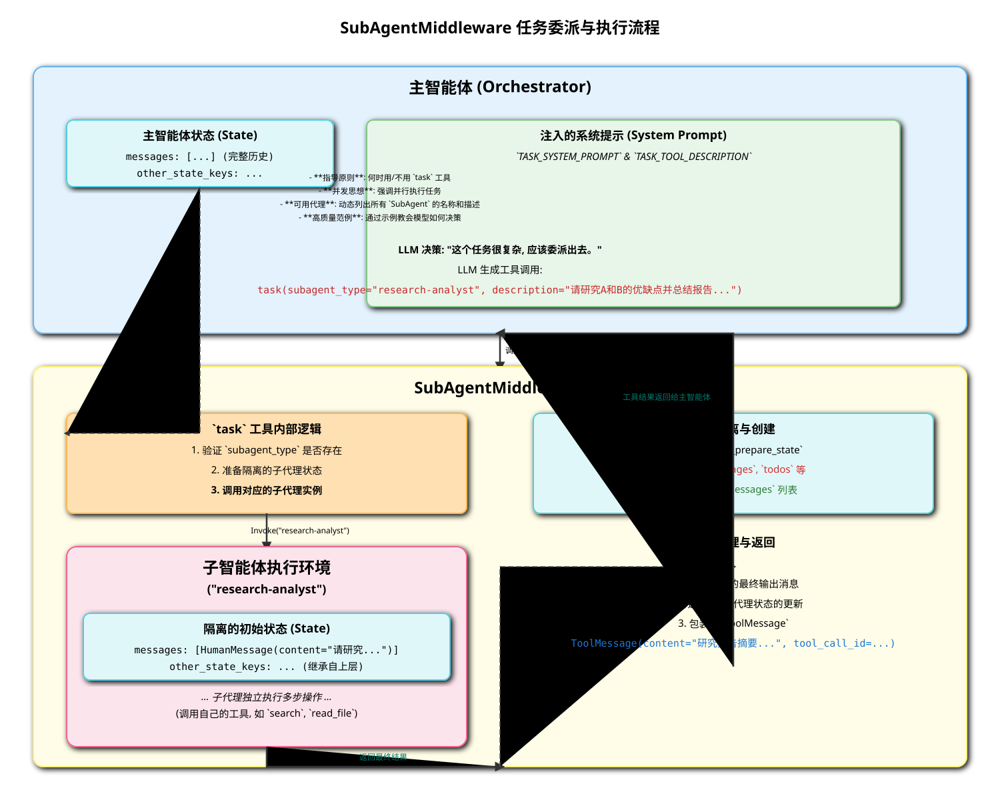

# 高级功能：通过 `SubAgentMiddleware` 实现任务委派

`SubAgentMiddleware` 是 `deepagents` 框架中一个强大而高级的组件，它为 Agent 提供了任务分解和委派的能力。其核心思想是允许一个主 Agent (Main Agent) 将一个复杂的、可以独立完成的子任务，完全委托给一个全新的、隔离的子 Agent (Sub-Agent) 去执行。

这种模式带来了几个关键优势：

*   **上下文隔离 (Context Isolation)**: 子 Agent 在一个完全纯净的环境中开始工作，拥有自己的记忆和状态。这避免了主 Agent 复杂的历史对话对子任务造成干扰，提高了执行的稳定性和准确性。
*   **关注点分离 (Separation of Concerns)**: 主 Agent 可以专注于更高层次的规划和协调，而将具体的、耗时的执行细节交给专门的子 Agent。
*   **效率提升 (Efficiency Improvement)**: 主 Agent 的 Prompt 可以被设计为鼓励并行发起多个独立的 `task` 调用，从而让多个子 Agent 并发执行，极大地缩短了复杂任务的总耗时。

## 流程图：一次任务委派的生命周期

下面的流程图详细描绘了从主 Agent 发起委派到子 Agent 完成任务并返回结果的全过程。

### 流程详解

1.  **主 Agent 决定委派 (Main Agent Decides to Delegate)**
    *   在其内部的“思考”（Thought）过程中，主 Agent 识别出一个可以被独立执行的子任务。例如，主 Agent 的目标是“验证代码变更”，它可能会决定第一步是“为 `main.py` 文件编写一个单元测试”。

2.  **调用 `task` 工具 (Main Agent Calls `task` Tool)**
    *   `SubAgentMiddleware` 向主 Agent 暴露了一个名为 `task` 的专用工具。
    *   主 Agent 不会自己去执行具体的文件操作，而是生成一个 `tool_call`，调用 `task` 工具，并通过 `description` 参数清晰地描述子任务的目标和要求。

3.  **中间件拦截调用 (Middleware Intercepts Call)**
    *   Agent 的工具调用请求首先会被中间件链捕获。`SubAgentMiddleware` 的 `wrap_tool_call` 钩子被触发。
    *   中间件检查到工具名称是 `task`，便会**拦截**这个调用，阻止它进入默认的工具执行逻辑。

4.  **创建并执行子 Agent (Middleware Creates & Executes Sub-Agent)**
    *   中间件的核心职责开始发挥作用。它会实例化一个 `SubAgentExecutor`。
    *   这个执行器会创建一个全新的、隔离的 Agent 实例。这个子 Agent 可以拥有与主 Agent 不同的系统提示（System Prompt）、不同的工具集，甚至不同的中间件配置，从而为特定任务进行深度优化。
    *   子 Agent 以 `description` 的内容作为它的初始任务输入，开始独立运行。

5.  **子 Agent 的独立生命周期 (Sub-Agent's Independent Lifecycle)**
    *   子 Agent 拥有完全独立的“思考-行动”循环。它可以读取文件、写入文件、调用其他工具，就像一个常规的 Agent 一样。
    *   重要的是，它的所有活动都发生在其自己的 `AgentState` 中，完全不会影响或“污染”主 Agent 的状态和记忆。

6.  **子 Agent 返回结果 (Sub-Agent Returns Result)**
    *   当子 Agent 完成其任务后，它会得出一个最终的结论或产出。例如，“测试文件 `test_main.py` 已成功创建”。
    *   `SubAgentExecutor` 捕获这个最终的 `AIMessage` 作为子任务的执行结果。

7.  **中间件格式化结果 (Middleware Formats Result)**
    *   `SubAgentMiddleware` 接收到来自 `SubAgentExecutor` 的结果。
    *   它将这个结果字符串包装成一个标准的 `ToolMessage`，使其看起来就像任何一个普通工具的返回结果。

8.  **主 Agent 接收工具结果 (Main Agent Receives Tool Result)**
    *   这个 `ToolMessage` 被添加回主 Agent 的消息历史中。
    *   对于主 Agent 来说，它“感觉”就像只是调用了一个名为 `task` 的普通工具，并收到了它的返回结果，而完全不知道背后有一个完整的 Agent 运行了一遍。

9.  **主 Agent 继续执行 (Main Agent Continues)**
    *   主 Agent 读取 `ToolMessage` 的内容，得知子任务已经完成。
    *   基于这个新的信息，它继续进行下一步的规划。例如，“测试已经写好了，现在我需要执行它”。

通过这种精巧的封装和抽象，`SubAgentMiddleware` 实现了一种强大的“Agent-as-a-Tool”模式，极大地扩展了 `deepagents` 框架解决复杂问题的能力。